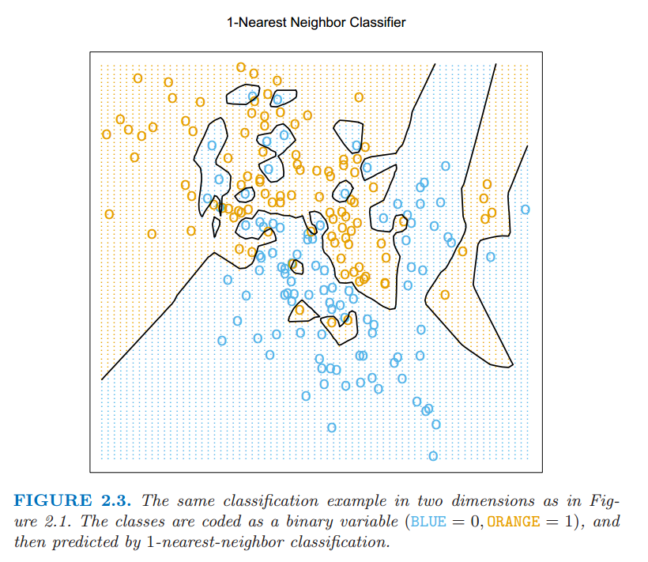
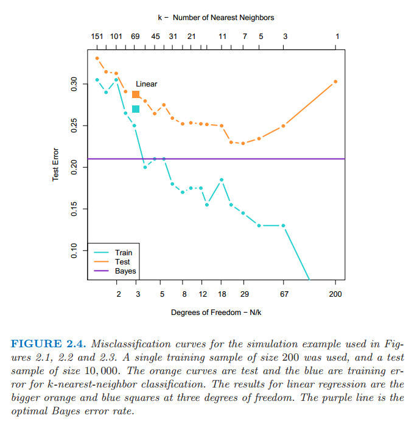

# 2.3 两种简单的预测方式：最小二乘和最近邻

本节讨论两种简单但很有用的预测方法：最小二乘法的线性模型拟合和 $k$-最近邻预测规则。线性模型对结构做出很强的假设，而且得出稳定但可能不正确的预测。$k$-最近邻方法对结构的假设很宽松，它的预测通常是准确但不稳定的。

## （ 1 ）线性模型和最小二乘法

线性模型已经成为过去 $30$ 年统计学的支柱，而且仍然是我们最重要的工具。给定输入向量 $X^T=(X_1,X_2,\cdots,X_p)$，我们通过模型

$$
\hat{Y} = \hat{\beta}_0+\sum\limits_{j=1}^{p}X_j\hat{\beta}_j
\tag{2.1}
$$

来预测输出 $Y$。

$\hat{\beta}_0$ 是截距，在机器学习中也称为 **偏差 (bias)**。为了方便起见，通常会把常数 $1$ 放如输入向量 $X$，把 $\hat{\beta}_0$ 放进系数向量 $\hat{\beta}$ 中，然后用向量内积形式写出线性模型

$$
\hat{Y} = X^T\hat{\beta}
\tag{2.2}
$$

其中 $X^T$ 为向量的转置（$X$ 为列向量）。这里我们对单个输出建模，所以 $\hat{Y}$ 为标量形式；更一般地，当存在 $K$ 个输出变量时， $\hat{Y}$ 可以是一个 $K$ 维向量，此时 $\hat \beta$ 是一个 $p\times K$ 的系数矩阵。

在单输出模型的 $(p+1)$ 维`输入-输出`空间中，$(X,\hat{Y})$ 表示一个超平面。如果常数项包含在 $X$ 中，则该超平面过原点，而且是一个子空间；如果常数项未包含在 $X$ 中，则超平面是一个过点 $(0,\hat{\beta}_0)$ 切 $Y$ 轴的仿射集。从现在起，我们均假设截距项包含在 $\hat{\beta}$ 中。如果将输出看成是 $p$ 维输入空间的函数，则 $f(X)=X^T\beta$ 是线性的，其梯度 $f'(X)=\beta$ 是一个代表输入空间中变化速度最快方向的向量。

根据训练数据怎样拟合线性模型？有许多不同的方法，但目前为止最受欢迎的是最小二乘法。在这个方法里面，我们选取系数 $\beta$ 使得残差平方和最小：

$$
\mathrm{RSS}(\beta) = \sum_{i=1}^N(y_i-x_i^T\beta)^2
\tag{2.3}
$$

$\mathrm{RSS}(\beta)$ 是系数的二次函数，因此其最小值总是存在，但可能不唯一。它的解用矩阵来表示最简单，可以写成：

$$
\mathrm{RSS}(\beta) = (y-\mathbf{X}\beta)^T(y-\mathbf{X}\beta)
\tag{2.4}
$$

其中，$\mathbf{X}$ 是 $N\times p$ 矩阵，每一行是一个输入向量，$\mathbf{y}$ 是训练集里面的 $N$ 维输出向量。关于 $\beta$ 微分后，有方程组：

$$
\mathbf{X}^T(\mathbf{y}-\mathbf{X}\beta)=0
\tag{2.5}
$$

如果 $\mathbf{X}^T\mathbf{X}$ 非奇异，则唯一解为：

$$
\hat{\beta}=(\mathbf{X}^T\mathbf{X})^{-1}\mathbf{X}^T\mathbf{y}
\tag{2.6}
$$

而且第 $i$ 个观测的输入 $x_i$ 的拟合值为 $\hat{y}_i=\hat{y}(x_i)=x_i^T\hat{\beta}$ 。在任意输入 $x_0$ 处，预测值为 $\hat{y}(x_0)=x_0^T\hat{\beta}$。整个拟合曲面的几何形态由 $\hat{\beta}$ 的 $p$ 个系数所决定。

接下来看一个线性模型在分类问题中的例子。

图 2.1 显示了训练数据在一对输入 $X_1$ 和 $X_2$ 的散点图。数据是模拟生成的，输出的分类变量 $G$ 取值为蓝色或橘黄色，而且如散点图所示，每个类都有 $100$ 个实例点。采用线性回归模型去拟合这些数据，当蓝色时将响应变量 $Y$ 编码为 $0$，当橘黄色时将其编码为 $1$。上面回归中的拟合值 $\hat{Y}$ 根据下面规则转化为类变量 $\hat{G}$

$$
\hat{G}=
\left\{
\begin{array}{cc}
\color{orange}{ORANGE}\quad&\text{if }\hat{Y} > 0.5\\
\color{blue}{BLUE}\quad & \text{if }\hat{Y}\le 0.5
\end{array}
\right.
\tag{2.7}
$$

> 图 2.1：两元输入变量分类的例子。类别被编码为二进制变量（蓝色为 $0$，橘黄色为 $1$），通过线性回归进行拟合。图中直线是判别边界，直线的方程为 $x^T\hat{\beta}=0.5$。橘黄色阴影区域表示这一区域的点被分成橘黄色，而蓝色阴影区域被分成蓝色。

在 $\mathbb{R}^2$ 空间中，被分成橘黄色类的点对应 $\{x:x^T\hat{\beta}>0.5\}$，如图 2.1 中显示的那样，而且两个预测的类被判别边界 $\{x:x^T\hat{\beta}=0.5\}$ 隔开，在这种情形下判别边界是线性的。可以看到判别边界的两边都有被分错的点。或许是因为线性模型太严格了，又或许是因为这些错误无法避免。无论如何，请记住这是训练数据本身的错误，而我们并没有说数据的来源。考虑下面两种可能的情境：

**情境 1：** 每一类的训练数据都是从某个二元正态分布（不同类对应的正态分布之间不相关且均值不同）中生成的。

**情境 2：** 每一类的训练数据是来自 $10$ 个低方差的高斯分布的混合，每一个高斯分布都有各自的均值。

就生成模型而言，混合的高斯分布是描述得最好的。首先产生一个离散随机变量，该变量决定使用哪个部分的高斯分布，然后根据所选择的高斯密度产生观测值。在每个类都是一个高斯分布的情形下，我们将在第四章看到一个线性的判别边界是最好的，而且我们的估计也几乎是最优的。区域的重叠不可避免，而且将要被预测的数据因为数据重叠也会变得很麻烦。

在混合紧密聚集的高斯分布中情形不一样了。一个线性的判别边界不大可能是最优的，而且事实上也不是。最优的判别边界是非线性不相交的，而且作为这种判别边界，将会更难确定。

我们现在来看一下另一种分类和回归的过程，在某种程度上是与线性模型相反的一种做法，但却更好地能够适用第二种情形。

## （ 2 ）最近邻方法

最近邻方法用训练集 $\mathcal{T}$ 中在输入空间上距离输入值 $x$ 最近的一组观测值，来生成 $\hat{Y}$。特别地，对 $\hat{Y}$ 的 $k$-最近邻拟合定义如下：

$$
\hat{Y}(x)=\frac{1}{k}\sum\limits_{x_i\in N_k(x)}y_i\tag{2.8}
$$

$N_k(x)$ 是在训练样本中 $k$ 个离 $x$ 最近的点 $x_i$ 组成的友邻集合。远近意味着度量，目前假设为欧氏距离。因此，用文字叙述就是：我们在输入空间中找到离 $x$ 最近的 $k$ 个观测 $x_i$，然后取其输出值的平均。

图 2.2 中采用了图 2.1 中同样的训练数据，然后采用 $15$-最近邻平均二进制编码做拟合。此时 $\hat{Y}$ 其实是橘黄色样本点在邻域中所占的比例，如果 $\hat{Y} > 0.5$ ，表明邻域中橘黄色的点数量占了主要部分，所以将橘黄色的类赋值给 $\hat{G}$；否则赋值为蓝色。有颜色的区域表明该区域里面的点根据上述规则分成了橘黄色和蓝色（ 实际上是对网格上的点进行赋值形成的 ）。可以看到分开蓝色和橘黄色的判别边界更加不规则，而且对应于某一类所主导的局部聚集。

> 图 2.2 图 2.1 中一样的二维分类的例子。类别被二进制变量编码（蓝色为 $0$，橘黄色为 $1$），通过 $15$-最近邻平均拟合。因此预测的类别是选择 $15$-最近邻中占大部分的类别。

图 2.3 显示了 $1$-最近邻 的分类结果：$\hat{Y}$ 被赋了距离 $x$ 的最近点 $x_{\ell}$ 的值 $y_{\ell}$ 。这种情形下，区域的分类可以相对简单的计算出来，对应训练数据的 **泰森多边形图 (Voronoi tessellation)** 。每个点 $x_i$ 都有一个对应的区域，该区域内的所有点都距离 $x_i$ 最近，因此，其分类值 $\hat{G}(x)=g_i$。判别边界相较 $15$- 最近邻分类更加地不规则了。

> 图 2.3 通过 $1$-最近邻分类预测图 2.1 中相同的数据。类别被二进制变量编码（蓝色为 $0$，橘黄色为 $1$）。

对于关于定量输出变量 $Y$ 的回归问题，**k-最近邻平均 (k-nearest-neighbor averaging)** 方法的定义和 式（ 2.8 ） 完全一样，尽管 $k=1$ 是不太可能的选择。

相比较图 2.1 ，在图 2.2 中更少的观测值被错误分类，但这个似乎无法给我们太大的安慰，因为图 2.3 中没有一个训练数据被错误地分类。一个小小的想法表明在 $k$-最近邻拟合中，训练数据的误差应该近似是关于 $k$ 的增函数，而且当 $k=1$ 时误差总是为 $0$。用一个独立的测试集比较上述三种方法会给出一个更为客观评价。

看起来 $k$-最近邻拟合只有一个参数，即 $k$ 值的大小，而在最小二乘法中有 $p$ 个参数。尽管情况就是这样，我们将会看到 $k$-最近邻的有效参数个数其实是 $\frac{N}{k}$，而且一般会比 $p$ 大。随着 $k$ 的增长有效参数个数会减少。为了搞清楚为什么，你可以注意，假设邻域之间没有重叠，则所有样本点应当构成 $\frac{N}{k}$ 个邻域，其中每一个区域内拟合了一个可视为参数的值。

我们不能在训练集上将误差平方和作为选择 $k$ 的标准，因为最终总会选择 $k=1$。$k$-最近邻方法对于上文中描述的情境 $2$ 可能更适合，尽管 $k$-最近邻判别边界对于高斯分布的数据会有不必要的噪声。

## （ 3 ）从最小二乘到最近邻

最小二乘法的线性判别边界非常光滑，而且显然拟合得更稳定。它似乎严重依赖于“线性判别边界是合理的” 这一前提假设。事实上，我们马上会讨论到，它存在低方差和高偏差的现象。

$k$-最近邻方法似乎不非常依赖任何关于数据的假设，而且可以适用于任何情形。然而，判别边界的任何特定分区都依赖几个输入点和其特定位置，并且因此而左右摇摆不稳定，即存在高方差和低偏差的现象。

每种方法都有擅长处理的情形；特别地，线性回归更适合上面介绍的情形 $1$，而最近邻方法最适合情形 $2$。

事实上，试验数据是从介于两种情形之间的模型中模拟出来的，不过更接近情形 $2$。其过程大致如下：

- 从二元高斯分布 $N((1,0)^T,\bf{I})$ 中产生 $10$ 个均值 $m_k$，标记此类为蓝色。

- 从二元高斯分布 $N((0,1)^T,\bf{I})$ 中产生 $10$ 个均值 $m_k$ ，并标记此类为橘黄色。

- 对每一类按照下面方式产生 $100$ 个观测：对于每个观测，我们以 $1/10$ 的概率随机选择一个 $m_k$，然后产生 $N(m_k,\bf{I}/5)$，因此对于每一类引出了一个高斯分布簇的混合。
  
图 2.4 显示了从该模型产生 $10000$ 个新观测的的分类结果，我们比较了最小二乘法和一系列 $k$ 值对应的 $k$-最近邻分类结果。

> 图 2.4：在图 2.1、图 2.2、图 2.3 中运用的模拟例子的错误分类曲线。我们用的是 $200$ 个样本作为训练数据，检测数据规模为 $10000$个。橘黄色的曲线对应 $k$-最近邻分类的测试数据，蓝色的曲线对应 $k$-最近邻分类的训练数据。线性回归的结果是在自由度为 $3$ 上的大橘黄色和蓝色的方块。紫色的直线是最优的贝叶斯错误率。

当前最受欢迎的技巧中，有一大部分是这两种方法的变形。事实上，$1$-最近邻法是所有方法中最简单的，夺取了低维问题的大部分市场。下面列举描述了一些增强的方式：

- 核方法使用随着到目标点的距离增大而平滑递减至 $0$ 的权重，而不是像在 $k$-最近邻中使用 $0/1$ 权重系数
- 在高维空间中，对距离核做修改，调整不同变量的权重
- 通过局部加权最小二乘拟合线性模型来实现局部回归，而不是用常数值来拟合
- 在原始输入的基函数基础上做线性拟合，从而允许任意复杂的模型
- 投影和神经网络等由线性模型的非线性转换组成的模型
