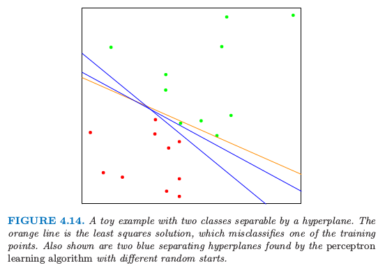
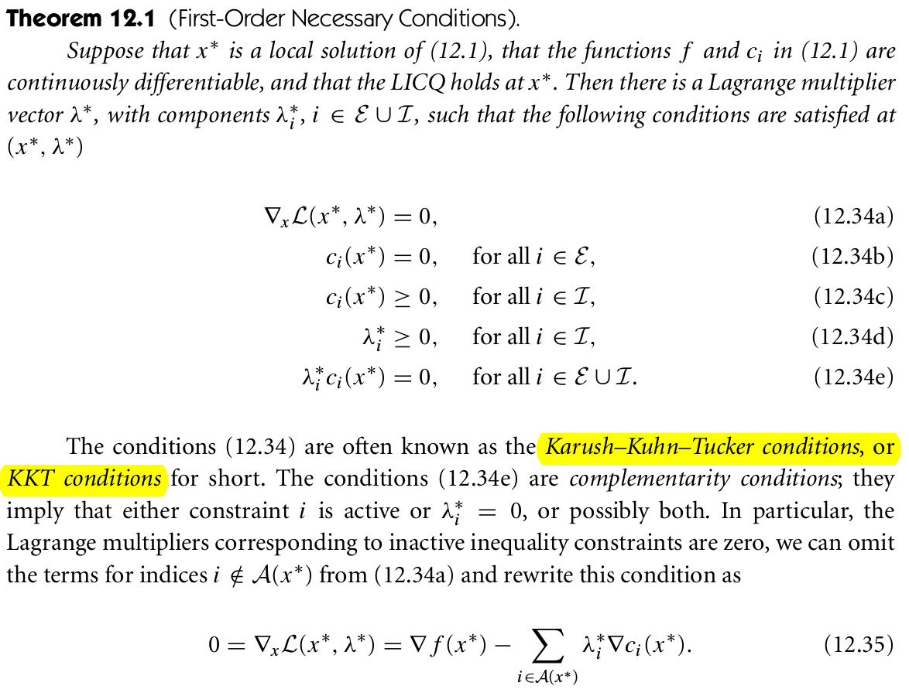
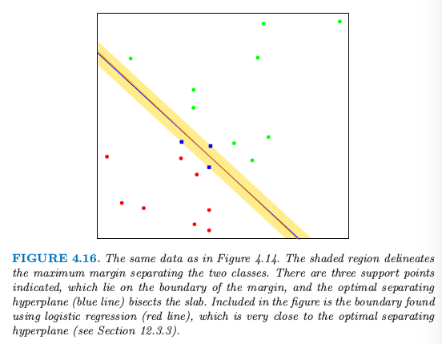

# 4.5 分离超平面

我们已经看到线性判别分析和逻辑斯蒂回归估计线性判别边界的方式很相似，但是又有些不同。这章的剩下部分我们来描述一下**分离超平面分类器 (separating hyperplane classifiers)**。这些过程构造线性判别边界时试图把数据尽可能分到不同的类别中去。它们可以看成是将在 [12 章](../12-Support-Vector-Machines-and-Flexible-Discriminants/12.1-Introduction/index.html)讨论的支持向量机的基础。这节的数学层次比前面的章节更高一点。

图 4.14 显示了 $\mathbb{R}^2$ 空间中两个类别的 20 个数据点。

> 图 4.14. 被超平面分离开的两个类别的简单例子。橘黄色的线条是最小二乘的解，误判了训练集中的一个点。图中也显示了通过不同初始值运用感知器学习算法得到的分离超平面。

这些点可以被线性边界分离开。图中的蓝色线条是无穷种可能**分离超平面**中的两个。黄色的线条表示该问题的最小二乘解，通过在 $X$ 上对 $-1/1$ 响应变量 $Y$ 回归得到（带有截距）；该直线由下式给出

$$
\{x:\hat\beta_0+\hat\beta_1x_1+\hat\beta_2x_2=0\}\tag{4.39}
$$

最小二乘解并不能很好地把点分离开，而且有一个误判。这与通过 LDA 找到的边界相同，这因为在两个类别的情况下 LDA 与线性回归是等价的。（[4.3 节](../4.3-Linear-Discriminant-Analysis/index.html)和[练习 4.2](https://github.com/szcf-weiya/ESL-CN/issues/108)）

!!! info "weiya 注：Ex. 4.2"
    具体证明过程见[Issue 108: Ex. 4.2](https://github.com/szcf-weiya/ESL-CN/issues/108)

类似 $式（ 4.39 ）$ 的分类器计算输入特征的线性组合并且返回符号，在 1950s 末期称之为**感知器 (perceptrons)** (Rosenblatt,1958[^1]) 。感知器是 1980s 和 1990s 神经网络模型的基础。

在我们继续之前，稍微岔开去回顾一些向量代数的知识。图 4.15 描述了由等式 $f(x)=\beta_0+\beta^Tx=0$ 定义的超平面或仿射集 $L$；因为我们是在 $\mathbb{R}^2$ 空间中，所以这是一条直线。这里我们列出一些性质：

1. 对于 $L$ 中的两点 $x_1$ 和 $x_2$，$\beta^T(x_1-x_2)=0$，因此 $L$ 表面的法向量为 $\beta^*=\beta/\Vert\beta\Vert$.
2. 对于 $L$ 的任意点，$\beta^Tx_0=-\beta_0$.
3. 任意点  $x$ 到 $L$ 的符号距离为
$$
\begin{align*}
{\beta^*}^T(x-x_0)&=\frac{1}{\Vert\beta\Vert}(\beta^Tx+\beta_0)\\
&=\frac{1}{\Vert f'(x)\Vert}f(x)\tag{4.40}
\end{align*}
$$
因此 $f(x)$ 与 $x$ 到由 $f(x)=0$ 定义的超平面符号距离成比例。

> 图4.15. 超平面（仿射集）的线性代数

## 4.5.1 Rosenblatt 感知器学习算法

**感知器学习算法 (perceptron learning algorithm)** 试图通过最小化误分类的点到判别边界距离来寻找分离超平面。如果响应变量 $y_i=1$ 是误分类的，则 $x_i^T\beta+\beta_0 < 0$，对于误分类的响应变量 $y_i=-1 $是反过来的。目标是最小化

$$
D(\beta,\beta_0)=-\sum\limits_{i\in\mathcal M}y_i(x_i^T\beta+\beta_0),\tag{4.41}
$$

其中 $\mathcal M$ 是误分类点的指标集。上式是非负的且与误分类的点到由 $\beta^Tx+\beta_0=0$ 定义的判别边界的距离成比例。梯度（假设 $\mathcal M$ 固定）由下式给出

$$
\begin{align*}
\dfrac{\partial D(\beta,\beta_0)}{\partial \beta}&=-\sum\limits_{i\in \mathcal M}y_ix_i\tag{4.42}\\
\dfrac{\partial D(\beta,\beta_0)}{\partial \beta_0}&=-\sum\limits_{i\in \mathcal M}y_i\tag{4.43}
\end{align*}
$$

这个算法实际上应用了**随机梯度下降 (stochastic gradient descent)** 来最小化分段线性准则。这意味着**不是**计算经过一步之后每个观测值的梯度贡献之和，**而是**当每个观测被访问之后采取新的一步。因此误分类的观测值会以某种次序被访问，而且参数 $\beta$ 通过下式更新

$$
\left(\begin{array}{}\beta\\\beta_0\end{array}\right)\leftarrow
\left(\begin{array}{}\beta\\\beta_0\end{array}\right)+
\rho\left(\begin{array}{}y_ix_iy_i\end{array}\right)
\tag{4.44}
$$

这里 $\rho$ 是学习速率，不失一般性这种情形下可以取1。如果类别是线性可分的，则可以证明在有限步后该算法收缩到一个分离超平面（[练习 4.6](https://github.com/szcf-weiya/ESL-CN/issues/109)）。图 4.14 显示了对一个简单问题的两个解，每个都是从不同的随机猜测开始的。

Ripley (1996)[^2] 总结了该算法有以下一些问题：

- 当数据是线性可分时，有许多解，且解基于初始值的设定。
- “有限”步可以非常大。差异越小，需要花的时间就越久。
- 当数据不是线性可分时，算法不会收敛，而且会形成循环。循环可以很长因此不容易检测。

第二个问题经常通过不在原空间中寻找超平面消除，而在一个通过构造在原空间中变量的基函数变换得到的增广空间中。这类似于在多项式回归问题中为了将残差降为 0 而使得阶数特别大。完美的分离不总是可以达到：举个例子，如果来自两个类别的观测值有一个共同输入。当然或许也不需要完美分割，因为得到的模型很可能是过拟合从而不能很好地进行推广。我们将在下一节的最后回到这个问题的讨论。

对于第一个问题的优雅解决方式是对分离超平面加上额外的约束条件。

## 4.5.2 最优分离超平面

最优分离超平面将两个类别分离开且使得超平面到每一个类别最近点的距离最大 (Vapnik, 1996)[^3]。这样不仅得到分离超平面问题的唯一解，而且通过使得在训练集上两个类别的**边缘 (margin)** 最大，这使得在测试集上有更好的分类表现。

我们需要推广准则 $式（ 4.41 ）$。考虑下面的优化问题

$$
\begin{align*}
\underset{\beta,\beta_0,\Vert\beta\Vert=1}{\max}& M\\
\mathrm{st} & y_i(x_i^T\beta+\beta_0)\ge M,\;i=1,\ldots,N
\end{align*}
\tag{4.45}
$$

这一系列条件保证了所有点到由 $\beta$ 和 $\beta_0$ 定义的判别边界的符号距离至少为 $M$，我们寻找最大的 $M$ 和相关的参数。我们可以通过把条件替换为下面的形式来摆脱 $\Vert\beta\Vert=1$ 的限制

$$
\frac{1}{\Vert\beta\Vert}y_i(x_i^T\beta+\beta_0)\ge M\tag{4.46}
$$

（重新定义了 $\beta_0$）或者等价于

$$
y_i(x_i^T\beta+\beta_0)\ge M\Vert\beta\Vert\tag{4.47}
$$

因为对于任意满足这些不等式的 $\beta$ 和 $\beta_0$，任意正的放缩因子同样成立，我们可以任意令 $\Vert\beta\Vert=1/M$。因此 (4.45) 等价于

$$
\begin{align*}
\underset{\beta,\beta_0}{\min}&\frac{1}{2}\Vert\beta\Vert^2\\
\mathrm{st}& y_i(x_i^T\beta+\beta_0)\ge 1 \; i=1,\ldots,N 
\end{align*}
\tag{4.48}
$$

根据 $式（ 4.40 ）$，上面的约束条件定义了一个判别边界周围厚度为 $1/\Vert\beta\Vert$ 的**平板 (slab)** 或者**空白 (margin)**。因此我们选择 $\beta$ 和 $\beta_0$ 最大化厚度。这是一个凸优化问题（线性不等约束的二次准则）。Lagrange（原问题）函数关于 $\beta$ 和 $\beta_0$ 进行最小化是

$$
L_P=\frac{1}{2}\Vert\beta\Vert^2-\sum\limits_{i=1}^N\alpha_i[y_i(x_i^T\beta+\beta_0)-1]\tag{4.49}
$$

令微分为 0，则有

$$
\beta=\sum\limits_{i=1}^N\alpha_iy_ix_i\tag{4.50}
$$

$$
0=\sum\limits_{i=1}^N\alpha_iy_i\tag{4.51}
$$

替换掉 $式（ 4.49 ）$ 中的这些项我们得到被称作 Wolfe 的对偶问题
$$
L_D=\sum\limits_{i=1}^N\alpha_i-\frac{1}{2}\sum\limits_{i=1}^N\sum\limits_{k=1}^N\alpha_i\alpha_ky_iy_kx_i^Tx_k\\
\qquad\qquad \qquad \qquad \qquad \mathrm{st}\; \alpha_i\ge 0\qquad \tag{4.52}
$$

!!! note "weiya 注：对偶问题"
    对于无等值约束的优化问题

    $$
    \underset{x\in\mathbb{R}^n}{\min}f(x)\; \mathrm{st}c_i(x)\ge 0,\; i=1,2,\ldots,m
    $$

    记
    $$
    c(x)\def(c_1(x), c_2(x),\ldots, c_m(x))^T
    $$
    则原问题写为
    $$
    \underset{x\in\mathbb{R}^n}{\min}f(x)\; \mathrm{st}c(x)\ge 0
    $$
    Lagrangian 函数为
    $$
    {\mathcal L}(x,\lambda)=f(x)-\lambda^Tc(x)
    $$
    定义对偶目标函数 $q:\mathbb{R}^n\rightarrow \mathbb{R}$：
    $$
    q(\lambda)\def\underset{x}{\inf}\mathcal L(x,\lambda)
    $$
    其定义域为
    $$
    \mathcal D\def\{\lambda\mid q(\lambda)>-\infty\}
    $$
    **若 $f$ 和 $-c_i$ 均为凸函数**，则$\mathcal L(\cdot, \lambda)$也为凸函数，则可以很容易计算$q(\lambda)$。

    参考资料: [Wright S, Nocedal J. Numerical optimization (Second Edition). Springer Science.](../references/opbook2.pdf)

通过在正象限内最大化 $L_D$ 得到解，这是一个简单的凸优化问题，可以使用标准的软件来求解。另外解必须满足 KKT(Karush-Kuhn-Tucker) 条件,它包括 $式（ 4.50 ）$，$式（ 4.51 ）$，$式（ 4.52 ）$ 以及

$$
\alpha_i[y_i(x_i^T\beta+\beta_0)-1]=0\;\forall i.\tag{4.53}
$$

!!! note "weiya 注：KKT条件"
    对于带约束的优化问题
    
    一阶必要条件为
    
    图片来源：[Wright S, Nocedal J. Numerical optimization (Second Edition). Springer Science.](../references/opbook2.pdf)

从这些我们看到

- 如果 $\alpha_i\gt 0$，则 $y_i(x_i^T\beta+\beta_0)=1$，或者换句话说，$x_i$ 在 slab 的边界上；
- 如果 $y_i(x_i^T\beta+\beta_0)>1$，$x_i$ 不在平板的边界上，而且 $\alpha_i=0$。

从 $式（ 4.50 ）$ 我们可以看到解向量 $\beta$ 定义为**支撑点 (support points)** $x_i$ 的线性组合——这些点通过 $\alpha_i >0$ 定义在 slab 的边界上。图 4.16 显示了我们那个简单例子的最优分离超平面；这里有三个支撑点。同样地，$\beta_0$ 可以通过对任意支撑点求解 $式（ 4.53 ）$ 得到。

> 图 4.16. 和图 4.14 同样的数据。阴影区域描绘了分离两个类别的最大边缘空白。这里有三个支撑点；它们位于边缘空白的边界上，最优分离超平面（蓝色线条）平分了平板。这张图里面的边界是通过逻辑斯蒂回归得到的（红色线条），它与最优分离超平面非常接近（见[12.3.3 节](../12-Support-Vector-Machines-and-Flexible-Discriminants/12.3-Support-Vector-Machines-and-Kernels/index.html)）

最优分离超平面得到函数 $\hat f(x)=x^T\hat\beta+\hat\beta_0$ 来对新的观测分类

$$
\hat G(x)=\mathrm{sign} \hat f(x)\tag{4.54}
$$

尽管没有训练观测点会落在空白边缘里面（由构造可知），但这对于测试观测点不一定正确。直觉上，若训练数据边缘空白较大，会使得在测试数据集上良好的分离。

关于支撑点的描述似乎表明解更加关注支撑点，而且对于模型错误更加稳健。而另一方面，LDA 的解取决于所有数据点，即便点远离判别边界。然而，注意到这些支撑点也需要用到所有数据点。当然，如果类别真的服从高斯分布，LDA 是最优的，分离超平面会因关注类别边界数据（噪声）而付出代价。

图 4.16 中还画出了该问题的通过极大似然法得到的逻辑斯蒂回归的解。这种情形下两个解都是很相似的。当存在分离超平面，逻辑斯蒂回归总是能找到它，因为这种情况下概率的对数值总能达到 0（[练习 4.5](https://github.com/szcf-weiya/ESL-CN/issues/110)）。逻辑斯蒂回归的解与分离超平面的解有其它的定性上的特点。系数向量通过在输入特征上零均值线性响应向量的加权最小二乘拟合来定义，对于离判别边界更近的点系数更大。

当数据不可分时，该问题没有可行解，需要另外的构造。同样我们可以利用基变换来扩大空间，但是这个可能导致通过过拟合进行人工分离。在[第 12 章](../12-Support-Vector-Machines-and-Flexible-Discriminants/12.1-Introduction/index.html)中我们将要讨论更加吸引人的方法，被称为**支持向量机 (support vector machine)**，它允许重叠，但是最小化了某种度量下的重叠。

[^1]: Rosenblatt, F. (1958). The perceptron: a probabilistic model for information storage and organization in the brain, Psychological Review 65: 386–408.
[^2]: Ripley, B. D. (1996). Pattern Recognition and Neural Networks, Cambridge University Press.
[^3]: Vapnik, V. (1996). The Nature of Statistical Learning Theory, Springer, New York.
