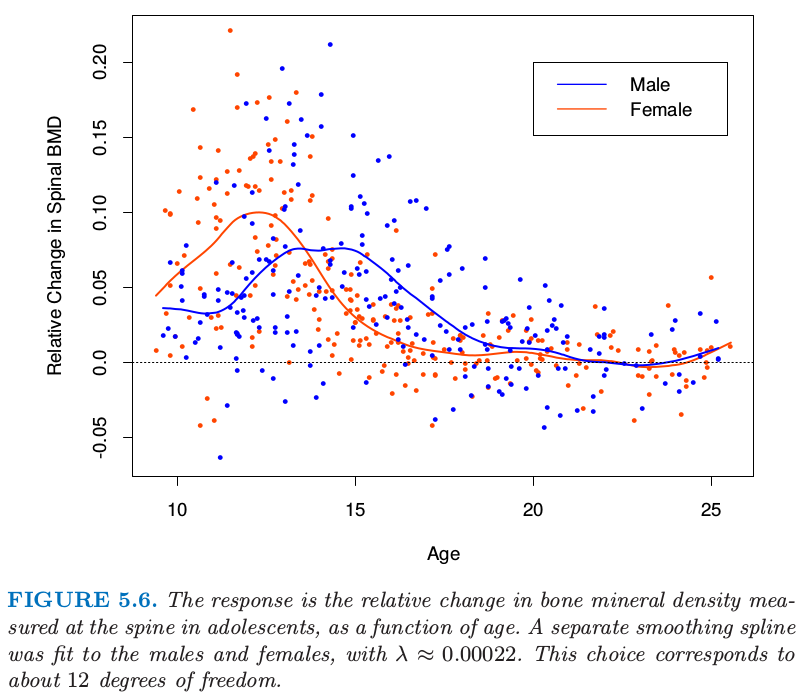
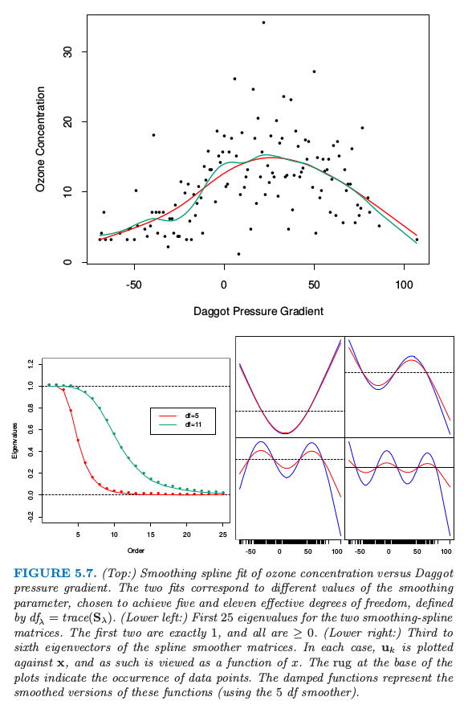
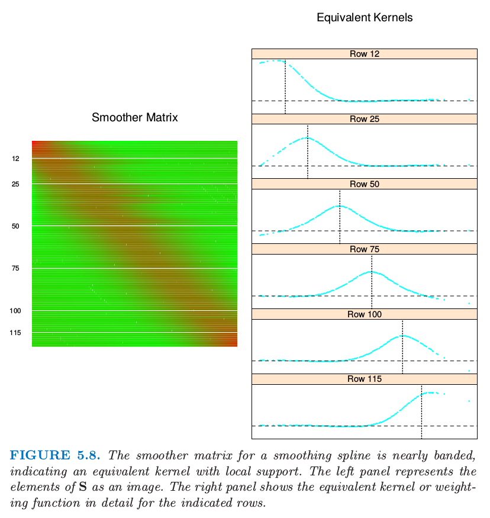

# 5.4 光滑样条

这里我们讨论使用最大结点集合的 **样条基方法** 来彻底避免结点选择的问题。拟合的复杂度由正则化来控制。考虑下面的问题：在所有二阶连续微分的函数 $f(x)$ 中，找到一个使得下面的惩罚残差平方和最小的函数

$$
\mathrm{RSS}(f,\lambda)=\sum\limits_{i=1}^N\{y_i-f(x_i)\}^2+\lambda\int \{f''(t)\}^2dt\tag{5.9}
$$

其中 $\lambda$ 是固定的**光滑参数 (smoothing parameter)**。第一项衡量与数据的近似程度，第二项对函数的曲率进行惩罚，且 $\lambda$ 建立了两者之间的一个平衡。两个特别的例子是：

- $\lambda=0$： $f$ 可以是对数据插值的任意函数
- $\lambda=\infty$： 简单的最小二乘拟合，因为不容忍任何的二次微分。

这从非常粗糙变到非常光滑，而且希望 $\lambda\in(0,\infty)$ 在非常粗糙与非常光滑之间表示一个对我们感兴趣的函数类。

!!! note "weiya 注"
    对于 $y=f(x)$ 曲线的曲率定义为
	  $$
	  \kappa = \frac{\vert y''\vert}{(1+y'^2)^{3/2}}
	  $$
	  <!--这里为什么只用二阶导？-->

准则 \eqref{5.9} 定义在无限维函数空间上——实际上，是二阶导有定义的 [Sobolev 函数空间](https://zh.wikipedia.org/wiki/%E7%B4%A2%E4%BC%AF%E5%88%97%E5%A4%AB%E7%A9%BA%E9%97%B4)。值得注意的是，可以证明 \eqref{5.9} 存在一个显式的有限维的唯一一个最小值点，是一个结点在不重复的 $x_i,i=1,2,\ldots,N$ 处的自然三次样条（[练习 5.7](https://github.com/szcf-weiya/ESL-CN/issues/34)）。表面上看，这个函数族仍然是过参量化，因为有 $N$ 个结点，这意味着 $N$ 个自由度。然而，惩罚项转换为对样条系数的惩罚，使得以某种方式向着线性拟合收缩。

!!! info "weiya 注：Ex. 5.7"
	已解决，详见 [Issue 34: Ex. 5.7](https://github.com/szcf-weiya/ESL-CN/issues/34).

因为解为自然样条，所以我们可以写成

$$
f(x)=\sum\limits_{j=1}^NN_j(x)\theta_j\tag{5.10}
$$

其中 $N_j(x)$ 是表示自然样条族的 $N$ 维基函数集（[5.2.1 节](5.2-Piecewise-Polynomials-and-Splines/index.html#_2)和[练习 5.4](https://github.com/szcf-weiya/ESL-CN/issues/31)）。

!!! info "weiya 注：Ex. 5.4"
	已解决，详见 [Issue 31: Ex. 5.4](https://github.com/szcf-weiya/ESL-CN/issues/31).

准则因此退化成

$$
\mathrm{RSS}(\theta,\lambda)=(\mathbf y-\mathbf N\theta)^T(\mathbf y-\mathbf N\theta)+\lambda\theta^T\Omega_N\theta\tag{5.11}
$$

其中 $\\{\mathbf N\\}\_{ij}=N_j(x_i)$ 以及 $\\{\Omega_N\\}\_{jk}=\int N^{\prime\prime}_j(t)N_k^{\prime\prime}(t)dt$。可以看到解为

$$
\hat\theta = (\mathbf N^T\mathbf N+\lambda\Omega_N)^{-1}\mathbf N^T\mathbf y\tag{5.12}
$$

是**广义岭回归**。拟合后的光滑样条由下式给出

$$
\hat f(x) = \sum\limits_{j=1}^NN_j(x)\hat\theta_j\tag{5.13}
$$

有效计算光滑样条的技巧将在本章的附录中讨论。

图 5.6 显示了对青少年骨矿物质密度（BMD）部分数据的光滑样条拟合。响应变量为连续两次检查时脊髓的 BMD 的相对改变，一般相隔一年。数据点的颜色由性别来编码，得到两个独立的拟合曲线。简单总结一下，曲线证实了数据中的证据，女性增长相对于男性要早两年。两种情形下光滑参数 $\lambda$ 都近似为 $0.00022$；它的选择将在下一节中讨论。

> 图5.6. 响应变量是青少年中脊髓的骨矿物质密度的相对改变，将它看成是年龄的函数。对男性和女性分别进行光滑样条拟合，其中$\lambda\approx 0.00022$。这个选择对应12个自由度。

## 自由度和光滑矩阵

我们还没有指出光滑样条的 $\lambda$ 是怎么选取的。本章的后面我们描述使用自动化方法，比如交叉验证。在这部分中我们讨论预先确定光滑度的直观方式。

预先选择了 $\lambda$ 的光滑样条是 **线性光滑 (linear smoother)** 的一个例子（如在线性算子中一样）。这是因为 \eqref{5.12} 的估计参数是 $y_i$ 的线性组合。记 $\hat{\mathbf f}$ 为 $N$ 维向量，其中的元素为在训练预测变量 $x_i$ 处的拟合值 $\hat f(x_i)$。则

$$
\begin{align*}
\hat{\mathbf f} &= \mathbf N(\mathbf N^T\mathbf N + \lambda\mathbf \Omega_N)^{-1}\mathbf N^T\mathbf y\\
	            &= \mathbf S_\lambda\mathbf y\qquad\qquad\qquad\tag{5.14}
\end{align*}
$$

再一次看到，拟合关于 $\mathbf y$ 是线性的，并且有限线性算子 $\mathbf S_\lambda$ 称作**光滑矩阵 (smoother matrix)**。这种线性的结果表明从 $\mathbf y$ 得到 $\hat {\mathbf f}$ 的方法不依赖 $\mathbf y$ 本身；$\mathbf S_\lambda$仅仅依赖于 $x_i$ 和 $\lambda$。

线性算子也出现在经典的最小二乘拟合中。假设 $\mathbf B_\xi$ 是 $M$ 个三次样条基函数在 $N$ 个训练点 $x_i$ 处取值的 $N\times M$ 矩阵，结点序列为 $\xi$，并且 $M < < N$。则拟合样条值向量由下式给出

$$
\begin{align*}
\hat{\mathbf f} &= \mathbf{B_\xi(B_\xi^TB_\xi)^{-1}B_\xi^Ty}\\
&= \mathbf {H_\xi y}\qquad\qquad\qquad\tag{5.15}
\end{align*}
$$

这里线性算子 $\mathbf H_\xi$ 是投影算子，在统计中也称作 **帽子矩阵 (hat matrix)**。$\mathbf H_\xi$ 和 $\mathbf S_\lambda$ 之间有许多重要的相似性和不同：

- 都是对称、半正定矩阵。
- $\mathbf{H_\xi H_\xi=H_\xi}$（幂等矩阵），而 $\mathbf S_\lambda \mathbf S_\lambda\preceq \mathbf S_\lambda $，表示右边项比左边项多一个半正定矩阵。这是$\mathbf S_\lambda$ 收缩本质的结果，我们将在下面进一步讨论。
- $\mathbf H_\xi$ 秩为 $M$，而 $\mathbf S_\lambda$ 秩为 $N$。

表达式 $M=\mathrm{trace}(\mathbf H_\xi)$ 给出了投影空间的维度，也是基函数的个数，因此是在拟合中涉及的参数个数。类似地，我们定义光滑样条的**有效自由度 (effective degrees of freedom)** 为

$$
\mathrm{df}_\lambda = \mathrm{trace}(\mathbf{S}_\lambda)\tag{5.16}
$$

这是 $\mathbf S_\lambda$ 的对角元之和。这个非常有用的定义允许我们以更加直观的方式对光滑样条进行参量化，而且许多其他的光滑器确实也是用这样一致的风格。举个例子，在图 5.6 中我们对每条曲线确定 $\mathrm{df}\_\lambda=12$，对应的$\lambda\approx 0.00022$ 是通过数值求解 $\mathrm{trace}(\mathbf S_\lambda)=12$ 得到的。许多理论都支持自由度的定义，这里我们只介绍部分。

因为 $\mathbf S_\lambda$ 是对称的（而且半正定），所以存在实特征值分解。在我们处理之前，将 $\mathbf S_\lambda$ 改写成 Reinsch 形式是很方便的

$$
\mathbf S_\lambda=(\mathbf I+\lambda \mathbf K)^{-1}\tag{5.17}
$$

其中 $\mathbf K$ 不依赖于 $\lambda$（[练习 5.9](https://github.com/szcf-weiya/ESL-CN/issues/35)）。

!!! info "weiya 注：Ex. 5.9"
	已解决，详见 [Issue 35: Ex. 5.9](https://github.com/szcf-weiya/ESL-CN/issues/35).

因为 $\hat{\mathbf f}=\mathbf S_\lambda y$ 是下式的解

$$
\underset{\mathbf f}{\mathrm{min}}(\mathbf{y-f})^T(\mathbf{y-f})+\lambda \mathbf{f^TKf}\tag{5.18}
$$

$\mathbf K$ 也称作 **惩罚矩阵 (penalty matrix)**，而且 $\mathbf K$ 的二次型形式可以表示成二阶差分（二阶差商）的加权和。$\mathbf S_\lambda$ 的特征值分解为

$$
\mathbf S_\lambda = \sum\limits_{k=1}^N\rho_k(\lambda)\mathbf u_k\mathbf u_k^T\tag{5.19}
$$

其中，

$$
\rho_k(\lambda)=\frac{1}{1+\lambda d_k}\tag{5.20}
$$

且$ d_k$ 是 $\mathbf K$ 对应的特征值。图 5.7（上）显示了对部分空气污染数据（128 个观测）应用三次光滑样条的结果。给出了两个拟合：对应大的惩罚 $\lambda$ 的更光滑的拟合以及一个对应小的惩罚的更粗糙的拟合。下图表示了对应光滑矩阵的特征值（左下图）和部分特征向量（右下图）。

> 图5.7. （上：）ozone concentration 与 Daggot pressure gradient 光滑样条拟合的对比。两个拟合对应不同的光滑参数值，选择它们达到 5 和 11 的有效自由度，有效自由度由 $df_\lambda =trace(\mathbf S_\lambda)$ 定义。（左下：）两个光滑样条矩阵的前 25 个特征值。前两个特征值恰好为 1，且所有都 $\ge 0$。（右下：）光滑样条矩阵的第 3 到第 6 个特征值。在每个情形下，$\mathbf u_k$作 出关于 $\mathbf x$ 的图象，而且因此被视为 $x$ 的函数。图象的横轴的须表示数据点出现的位置。阻尼函数表示这些函数的光滑版本（采用 5 个自由度的光滑器）。

特征表示的一些亮点如下：

- 特征向量不会受 $\lambda$ 变化的影响，因此由 $\lambda$ 索引的整个光滑样条族（对于特定的序列 $\mathbf x$）有相同的特征向量。
- $\mathbf {S_\lambda y}=\sum_{k=1}^N \mathbf u_k\rho_k(\lambda)\langle \mathbf{u_k,y}\rangle$， 因此光滑样条通过对 $\mathbf y$ 关于（全部）基 $\{\mathbf u_k\}$ 分解进行操作，并且通过 $\rho_k(\lambda)$ 来不同程度地收缩贡献。这与基于回归的方法相反，回归中组分要么不变，要么收缩为 0——这也就是，类似上面的投影矩阵 $\mathbf B_\xi$ 有 $M$ 个特征值等于 1，剩余特征值等于 0。基于这个原因光滑样条被称作**收缩 (shrinking)**光滑器，而回归样条被称作**投影 (projection)** 光滑器（图 3.17）
- 按 $\rho_k(\lambda)$ 下降排列的 $\mathbf u_k$ 序列的复杂度似乎在增加。确实，它们有阶数递增的多项式的**穿0 (zero-crossing)** 行为。因为 $\mathbf S_\lambda \mathbf u_k=\rho_k(\lambda)\mathbf u_k$，我们看到每个特征向量本身是怎样通过光滑样条来收缩：复杂度越大，收缩也就越大。如果 $\mathbf X$ 定义域为周期的，则 $\mathbf u_k$ 在不同频率下是正弦和余弦的。
- 前两个特征值总是 1，它们对应 $x$ 的2维函数特征空间（[练习 5.11](https://github.com/szcf-weiya/ESL-CN/issues/36)），它们从不收缩。
- 特征值 $\rho_k(\lambda)=1/(1+\lambda d_k)$ 是惩罚矩阵 $\mathbf K$ 的特征值 $d_k$ 的反函数，通过 $\lambda$ 来调节；$\lambda$ 控制 $\rho_k(\lambda)$ 下降为 0 的速率。$d_1=d_2=0$ 又一次表明线性函数没有被惩罚。
- 可以通过基向量 $\mathbf u_k$（Demmler-Reinsch基）来重参量化光滑样条。在这种情形下，光滑样条求解
$$
\underset{\mathbf\theta}{\mathrm{min}}\Vert \mathbf{y-U\theta}\Vert^2+\lambda \mathbf{\theta^TD\theta}\tag{5.21}
$$
其中 $\mathbf U$ 列向量为 $\mathbf u_k$，且 $\mathbf D$ 为元素为 $d_k$ 的对角矩阵。
- $\mathrm{df}_\lambda = \mathrm{trace}(\mathbf S_\lambda)=\sum_{k=1}^N\rho_k(\lambda)$。对于投影光滑器，所有的特征值为 1，每个特征值对应投影子空间的一个维度。

图 5.8 描述了一个光滑样条矩阵，行按 $x$ 排序。这种表示的带表明光滑样条是局部拟合方法，很像第 6 章的局部加权回归过程。右图详细显示了所选的 $\mathbf S$ 的行，我们称为 **等价核 (equivalent kernels)**。当 $\lambda\rightarrow 0, \mathrm{df}_\lambda\rightarrow N$，且 $\mathbf S_\lambda\rightarrow \mathbf I$，$\mathbf I$ 为 $N$ 维单位矩阵。当$\lambda\rightarrow \infty,\mathrm{df}_\lambda\rightarrow 2$， 且 $\mathbf S_\lambda\rightarrow \mathbf H$， $\mathbf H$ 为在 $\mathbf x$ 上线性回归的帽子矩阵。

> 图 5.8 光滑样条的光滑矩阵近似带状，表明局部支撑的等价核。左图将$\mathbf S$的元素表示成图象。右图详细显示了所指出的行的等价核或者加权函数。
