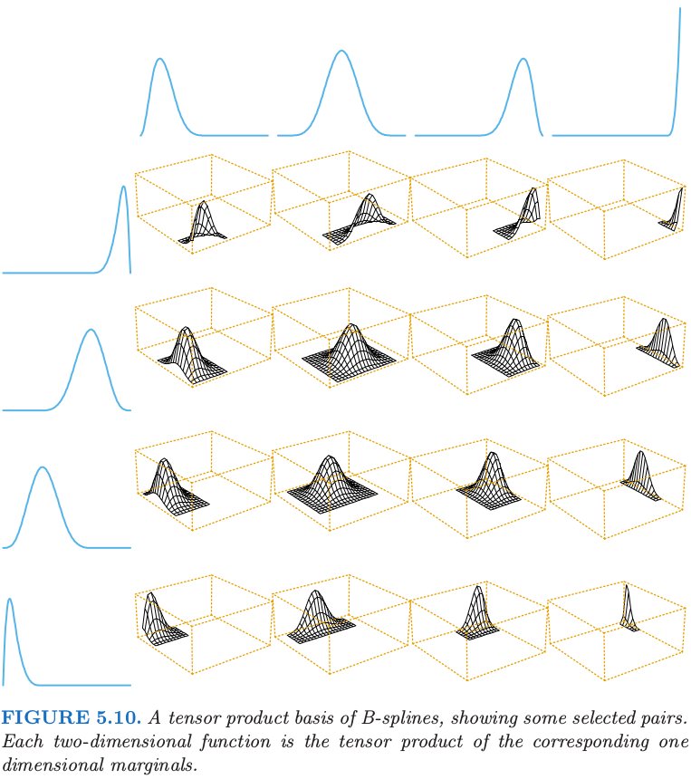
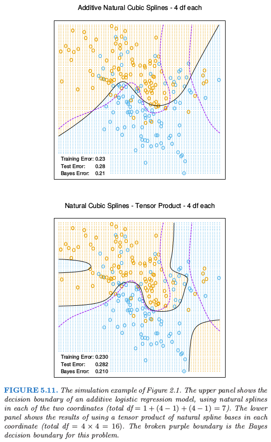
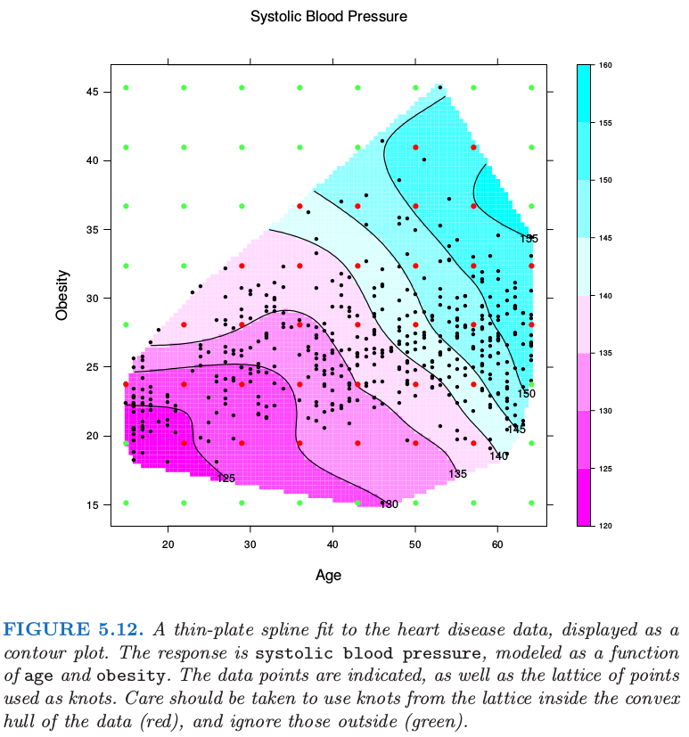

# 5.7 多维样条

目前为止我们集中讨论了一维样条模型。每种方法都有类似的多维情形。假设 $X\in\mathbb{R}^2$，并且我们有 $M_1$ 个 $X_1$ 坐标上的基函数 $h_{1k}(X_1),k = 1,\ldots,M_1$，类似地，有 $M_2$ 个 $X_2$ 坐标上的基函数 $h_{2k}(X_2), k = 1,\ldots,M_2$。则 $M_1\times M_2$ 维的 **张量积基函数 (tensor product basis)** 定义为：

$$
g_{jk}(X)=h_{1j}(X_1)h_{2k}(X_2) \ , \ j=1,\ldots, M_1 ; \ k=1,\ldots,M_2\tag{5.35}
$$

与一维基函数类似，上述张量积基可以被用来表示如下二维函数：

$$
g(X)=\sum\limits_{j=1}^{M_1}\sum\limits_{k=1}^{M_2}\theta_{jk}g_{jk}(X)\tag{5.36}
$$

图 5.10 展示了采用 B 样条的二维张量积基函数。与一维张量相同，系数采用最小二乘法拟合。相同方法可以推广到 $d$ 维的情况，但应注意基数量会指数型增长，这也是维数灾难的另一种表现形式。第 9 章讨论的 [MARS 过程](../09-Additive-Models-Trees-and-Related-Methods/9.4-MARS/index.html) 是一种通过最小二乘只将真正需要的张量积加入模型的向前贪婪算法。

图 5.11 展示了将可加样条和张量积（自然）样条应用到[第 2 章](../02-Overview-of-Supervised-Learning/2.1-Introduction/index.html)中的模拟分类例子中的区别。逻辑斯蒂回归模型 $\mathrm{logit}[\mathrm{Pr}(T\mid x)]=h(x)^T\theta$ 是对二值响应变量拟合的模型，并且估计出的决策边界为等值线 $h(x)^T\hat\theta=0$。张量积基函数在决策边界处可以实现更多的灵活性，但同时也引入了一些假的结构。

第 5.4 节的一维平滑样条（ 通过正则化 ）也可以推广到高维情形。假设有数据对 $y_i,x_i$，其中 $x_i\in \mathbb{R}^d$，我们的目标是寻找 $d$ 维函数 $f(x)$。想法是求解下面问题：

$$
\underset{f}{\min}\sum\limits_{i=1}^N\{y_i-f(x_i)\}^2+\lambda J[f]\tag{5.37}
$$

其中 $J$ 是用于在 $\mathbb{R}^d$ 空间中稳定（或平滑） $f$ 的某个惩罚函数。例如，式 （ 5.9 ）中的惩罚函数，泛化到 $\mathbb{R}^2$ 时为：

$$
F[f]=\int\int_{\mathbb{R}^2}\Big[
\Big(\frac{\partial^2f(x)}{\partial x_1^2}\Big)^2+
2\Big(\frac{\partial^2f(x)}{\partial x_1\partial x_2}\Big)^2+
\Big(\frac{\partial^2f(x)}{\partial x_2^2}\Big)^2
\Big]\mathrm{d}x_1\mathrm{d}x_2  \tag{5.38}
$$

采用该惩罚项去优化 (5.37) ，可以得到平滑的二维曲面，即著名的 `thin-plate 样条`。其与一维三次平滑样条有许多相同的性质：

- 当 $\lambda\rightarrow 0$，解近似为插值函数【 类似最小惩罚 ( 5.38 ) 】
- 当 $\lambda\rightarrow\infty$，解近似为最小二乘平面；
- 对于中等大小的 $\lambda$，解可以表示成基函数的线性展开，其中系数可以通过广义的岭回归得到。

解有如下形式：

$$
f(x)=\beta_0+\beta^Tx+\sum\limits_{j=1}^N\alpha_jh_j(x),\tag{5.39}
$$

其中 $h_j(x)=\Vert x-x_j \Vert^2\log\Vert x-x_j\Vert$。这些 $h_j$ 均属于将在下一节中详细讨论的 **径向基函数 (radial basis functions)** 。将 ( 5.39 ) 代入 (5.37) 可以解得系数，问题退化为有限维的带惩罚最小二乘问题。对于有限的惩罚，系数 $\alpha_j$ 必须满足一系列的线性约束；参见 [练习 5.14](https://github.com/szcf-weiya/ESL-CN/issues/166)。

对于任意维度的 $d$，当采用合适的、泛化形式的 $J$，可以定义更一般的 `thin-plate 样条`。

实际中有许多流行的 **混合方法 (hybrid approaches)**，都是为了计算和概念上的简单性。不像一维的平滑样条，由于一般没有稀疏结构可以利用，`thin-plate` 的计算复杂度为 $O(N^3)$。然而，和一维平滑样条一样，我们可以使用少于式 (5.39) 规定的连接点数 $N$ 。

实际中，通常采用覆盖定义域的网格就足够了。和前面一样，要为削减后的扩展计算惩罚。采用 $K$ 个连接点，计算量降至 $O(NK^2+K^3)$。

图 5.12 显示了对某些心脏病危险因子拟合 `thin-plate 样条`的结果，其中用等值图来表示表面。输入特征的位置已经表示出来，以及在拟合中采用的连接点。注意到 $\lambda$ 通过 $\mathrm{df}_\lambda=\mathrm{trace}(S_\lambda)=15$ 确定。

更一般地，可以将 $f\in\mathbb{R}^d$ 表示成任意多基函数的展开，并且通过应用类似 (5.38) 的正则化来控制复杂度。举个例子，通过所有成对单变量平滑样条基函数 (5.35) 的张量积来构造基，比如可以采用 [5.9.2 节](5.9-Wavelet-Smoothing/index.html#_2) 推荐的单变量 B 样条基函数。这导致随着维数增大，基函数指数型增长，一般地我们必须相应地减少每个坐标下的基函数数量。

[第 9 章](../09-Additive-Models-Trees-and-Related-Methods/9.1-Generalized-Additive-Models/index.html)讨论的可加样条模型是多维样条的限制版本。它们也可以用这种广义方式来表示；也就是，存在惩罚 $J[f]$ 保证解的形式为 $f(X)=\alpha+f_1(X_1)+\cdots+f_d(X_d)$，并且每个函数 $f_j$ 是单变量样条。在这种情形下，惩罚有时候退化，而且假设 $f$ 为可加的会更自然，接着简单地在每个组分函数上加上额外的惩罚：

$$
\begin{align*}
J[f] &= J(f_1+f_2+\cdots+f_d)\\
&=\sum\limits_{j=1}^d\int f_j^{\prime\prime}(t_j)^2 \mathrm{d}t_j\tag{5.40}
\end{align*}
$$

这些可以自然地推广到 `ANOVA 样条`分解，

$$
f(X)=\alpha+\sum_jf_j(X_j)+\sum\limits_{j < k}f_{jk}(X_j,X_k)+\cdots\tag{5.41}
$$

其中每个组分都是所要求维度下的样条。可以有许多选择：

- 交互的最大阶数 —— 我们之前展示过阶数为 $2$ 的情形
- 模型中包含哪些项 —— 不是所有的主效应和交互都需要考虑
- 采用什么表示方法 —— 具体选择有：
    - 少量的基函数：每个坐标上采用少量的基函数，并基于其张量积构造的回归样条
    - 所有基函数：和平滑样条一样采用所有基函数，在展开式中为每一项的包含一个合适的正则器。

在许多情形下，当潜在维度很大时，需要自动化的方法支持。[MARS](../09-Additive-Models-Trees-and-Related-Methods/9.4-MARS/index.html) 和 [MART](../10-Boosting-and-Additive-Trees/10.10-Numerical-Optimization-via-Gradient-Boosting/index.html)（分别在第 9 章和第 10 章）都是此类方法。
