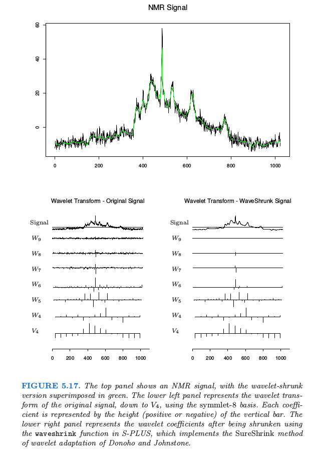
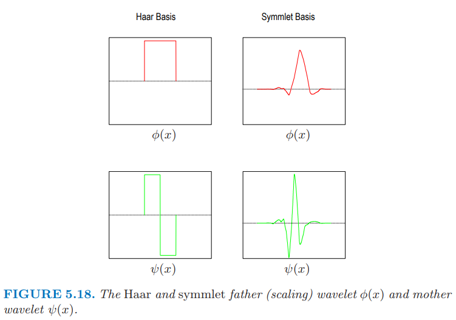
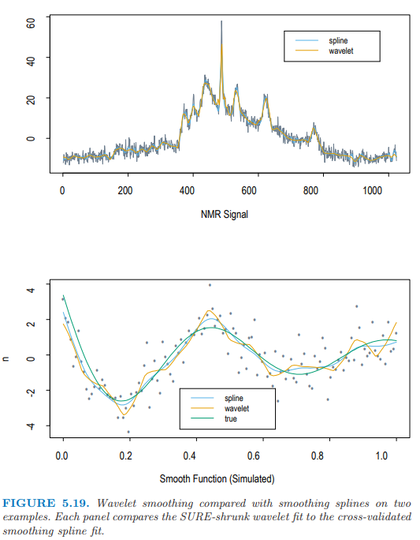

# 5.9 小波平滑

我们前文已经看到，有两种处理 **基函数字典 (dictionaries of basis functions)** 的模式。

- 一是在回归样条中，我们运用专业知识或者自动地来选择基函数字典的子集。自适应过程（如 [第 9 章](../09-Additive-Models-Trees-and-Related-Methods/9.0-Introduction/index.html) 的 MARS ）可以同时捕获平滑和非平滑的行为。
- 二是在平滑样条中，采用整个基函数字典，但是通过惩罚项将其系数向平滑方向收缩。

本节中的小波方法采取第二种方法，一般会使用整个正交基（函数字典）来表示函数，但会进一步对参数进行收缩或选择，以达到稀疏表示的目的。正如平滑函数可以用少量样条基函数来表示一样，对于大部分区域平滑、仅很少区域包含孤立凹凸块的函数，也可以用少量（凹凸不平的）基函数来表示。小波基在信号处理和压缩中非常流行，因为它们能够以一种非常有效的方式来表示平滑和（/或）局部凹凸不平的函数，这种方式被称为时间和频率的局部化。相反，传统的傅里叶基只允许频率局部化。

在介绍具体细节前，先看看图 5.16 中左边的 `Haar 小波`来直观感受小波平滑的实现。图中横轴表示时间；纵轴表示小波的尺度，底部尺度低，顶端尺度高。在每个尺度下，小波并排填充着整个时间轴：图中只展示出了其中一个子集。小波平滑通过最小二乘法来拟合小波基的系数，然后设置阈值来舍弃（或滤除）较小的系数（即舍弃相应的小波基）。由于在每个尺度下都有很多小波基函数，因此可以在需要时候选用它，不需要时候舍弃它，以此来实现时间和频率的局部化。`Harr 小波`很容易理解，但对大部分目标函数而言不够平滑。图 5.16 中右边的 `symmlet 小波`则既具有相同的正交性质，又很平滑。

图 5.17 展示了一个原子核偶磁共振信号，看上去由三部分组成：**整体的平滑组分**、**某些孤立的尖状峰** 和 **噪声**。采用 `symmlet 基`的小波变换显示在左下角图中。小波的系数按行排列，从底部的最低尺度到顶部的最大尺度。每一条线段的长度表明了系数的大小。右下角显示了当设置阈值并滤除后的小波系数。阈值滤除过程由式（ 5.69 ） 给出，是与线性回归中的 `lasso` 一样的软阈值过程（[3.4.2 节](../03-Linear-Methods-for-Regression/3.4-Shrinkage-Methods/index.html)）。注意到许多较小的系数均被强制设置成了 `0`。图中上边的绿色曲线显示了系数过滤后的向反向转换结果，也就是原始信号的平滑版本。在下一节我们将给出这一过程的细节，包括小波的构造和阈值规则。

## 5.9.1 小波基和小波变换

这一节我们将给出小波的构造和过滤的具体细节。小波基由一个`尺度函数（ Scaling Function ）`（也被称作 `父波，Father Wavelet`） $\phi(x)$ 经过平移和缩放后生成。图 5.18 的红色曲线是 `Haar` 和 `symmlet-8` 的尺度函数。

`Haar 基` 比较容易理解，特别是对于有着方差分析或者树知识的人，因为它产生了一个分段的常值表示。如果尺度函数表示为 $\phi(x) = I(x\in [0,1])$，则：

- 平移变换 $\phi_{0,k}(x)=\phi(x-k)$ （ $k$ 为整数 ）可以生成在整数连接点处跳跃的正交基函数，所有正交基函数构成的空间被称为参考函数空间 $V_0$。

- 缩放变换 $\phi_{1,k}=\sqrt{2}\phi(2x-k)$ 可以在 $\frac 12$ 尺度上，生成正交基函数，并构成一个新的函数空间 $V_1\supset V_0$ 。事实上，更一般地，随着尺度的不断细化，有 $\cdots\supset V_1\supset V_0\supset V_{-1}\supset \cdots$ ，其中每个函数空间 $V_j$ 均由 $\phi_{j,k}=2^{j/2}\phi(2^jx-k)$ 张成。

> 疑问： 为何是子集的包含关系？

现在我们来定义小波。

在方差分析中，我们经常用总均值 $\mu=\frac 12(\mu_1+\mu_2)$ 来表示成对的均值 $\mu_1$ 和 $\mu_2$，以及差异 $\alpha=\frac 12 (\mu_1-\mu_2)$。如果 $\alpha$ 非常小，则可以进行简化，因为我们可以将之设为 $0$ 。类似的，我们可以用 “ $V_j$ 中的某个组分” 加上 “ $V_j$ 相对于 $V_{j+1}$ 的正交补集 $W_j$ 中的某个组分” 的方式来表示 $V_{j+1}$ 中的某个函数，记为 $V_{j+1} = V_j\oplus W_j$ 。 $W_j$ 中的组分表示某个尺度范围内的细节（ 带通频率分量 ），而且我们有可能希望将这些组分中的某些元素置为 $0$。

容易看到，由 **母波 ( Mother Wavelet )** $\psi(x) = \phi(2x)-\phi(2x-1)$ 生成的 $\psi (x-k)$ 构成了 `Haar 族` 中 $W_0$ 的正交基。同样地，$\psi_{j,k}=2^{j/2}\psi(2^jx-k)$ 构成了 $W_j$ 的基。

> 注解：需理解父波和母波的区别，以及其物理含义。

现在 $V_{j+1}=V_j\oplus W_j=V_{j-1}\oplus W_{j-1}\oplus W_j$，所以除了用第 $j$ 层的细节（ 可理解为带通频率分量 ）和平滑组分（ 可理解为低通频率分量 ）来表示一个函数外，还可以将后者进一步分解为第 $j-1$ 层的细节和平滑组分，依次类推。最后可以得到表达式 $V_J=V_0\oplus W_0\oplus W_1\oplus \cdots\oplus W_{J-1}$。图 5.16 展示了某些特定的小波 $\psi_{j,k}(x)$。

注意：因为上述基函数空间是正交的，所有基函数也都是正交的。事实上，如果定义域是离散的，且最大有 $N=2^J$ 个（时间）点（ 即设定一个可以达到的最大尺度 ）；则在第 $j$ 层，会有 $2^j$ 个基函数，在 $W_j$ 中共有 $2^J-1$ 个元素，还有 $V_0$ 中的一个元素。这个结构化的正交基允许多分辨率分析（ 将在下一节中介绍 ）。

尽管 `Haar 基`可以帮助理解上述构造过程，但 `Haar 基`太粗糙了。幸运的是，已经发明了许多更加灵活的小波基。图 5.16 和 5.18 画出了 `Daubechies symmlet-8 基`。这个基比对应的 `Haar 基`有更平滑的组分，但是这有时需要权衡：

- 每个小波的支撑集包含 $15$ 个连续的时间间隔，而不像 `Haar 基`只包含一个。更一般地，$symmlet-p$ 族有 $2p-1$ 个连续间隔的支撑集。支撑集越宽，小波降至 $0$ 所花费的时间越长，因此可以更平滑。注意:有效支撑集似乎要窄很多。

- $symmlet-p$ 小波 $\psi(x)$ 有 $p$ 个消失矩 (vanishing moments)，也就是

    $$
    \int\psi (x)x^jdx=0,\; j=0,\ldots, p-1
    $$

    上式的其中一个意义是在 $N=2^J$ 个时间连接点上产生的任意阶数为 $p$ 的多项式，正好在 $V_0$ 中 ([习题 5.18](https://github.com/szcf-weiya/ESL-CN/issues/115)) 。在这种情形下，$V_0$ 等价于平滑样条惩罚中的零空间。`Haar 小波`有一个消失矩，且 $V_0$ 可以表示任意常值函数。

$symmlet-p$ 尺度函数是众多小波生成器族中的一个。操作类似 `Haar 基`：

- 如果 $V_0$ 由 $\phi(x-k)$ 展开，则 $V_1\supset V_0$ 由 $\phi_{1,k}(x)=\sqrt{2}\phi(2x-k)$ 张成，且对于某些过滤系数 $h(k)$，有 $\phi(x)=\sum_{k\in\mathcal Z}h(k)\phi_{1,k}(x)$ 。

- $W_0$ 由 $\psi(x) =\sum_{k\in\mathcal Z}g(k)\phi_{1,k}(x)$ 张成，其中过滤参数为 $g(k)=(-1)^{1-k}h(1-k)$。

## 5.9.2 自适应小波滤波

当数据在均匀格子上取值时，小波非常有用，比如数字化信号、图象，或者时间序列。我们首先关注一维的情形，假设总共有 $N=2^J$ 个格子点。假设 $\mathbf y$ 是响应向量，$\mathbf W$ 是在 $N$ 个等距间隔观测值上的 $N\times N$ 正交小波基矩阵。则 $\mathbf y^* = \mathbf W^T\mathbf y$ 被称作 $\mathbf y$ 的`小波变换 (wavelet transform)` 。

`SURE 收缩` (Stein Unbiased Risk Estimation, Donoho and Johnstone (1994)[^1]) 是自适应小波拟合的一种流行方法。我们以下面的准则开始：

$$
\underset{\boldsymbol\theta}{\min}\Vert \mathbf{y}-\mathbf{W}\boldsymbol\theta\Vert^2_2+2\lambda\Vert \boldsymbol\theta\Vert_1\tag{5.68}
$$

这与 [第 3 章](../03-Linear-Methods-for-Regression/3.4-Shrinkage-Methods/index.html) 中的 `lasso 准则`一样。因为 $\bf W$ 是正交的，所以导出下面简单的解：

$$
\hat\theta_j = \mathrm{sign}(y_j^*)(\vert y_j^*\vert-\lambda)_+\tag{5.69}
$$

最小二乘系数平移至 0，且在 0 处截断。拟合后的函数（向量）则由**逆小波变换** $\hat{\mathbf f} =  \mathbf{W}\hat{\boldsymbol{\theta}}$ 给出。

$\lambda$ 的一个简单选择是 $\lambda = \sigma \sqrt{2\log N}$，其中 $\sigma$ 是噪声标准偏差的估计。我们可以给出这种选择一些理由。因为 $\mathbf{W}$ 是正交变换，如果 $y$ 中的元素为白噪声（均值为 0 且方差为 $\sigma^2$ 的独立高斯随机变量），则 $y^*$ 也是。而且如果随机变量 $Z_1,Z_2,\ldots,Z_N$ 是白噪声，$\vert Z_j\vert, j=1,\ldots, N$ 最大值的期望近似为 $\sigma\sqrt{2\log N}$。因此所有小于 $\sigma \sqrt{2\log N}$ 的系数可能为噪声，且设为 0。

> note "weiya 注："
> Guy Nason 的 [Wavelet Methods in Statistics with R](http://www.springer.com/gp/book/9780387759609) 提到如下定理直接说明了上述结论：
    

空间 $\mathbf{W}$ 可以是任意正交函数的基：多项式，自然样条或者余弦。让小波变得特殊的是采用的基函数的特定形式，它允许**在时间和在频率上局部化 (localized in time and in frequency)** 的表示。

让我们再次看一下图 5.17 的 NMR 信号。采用 $symmlet-8$ 基来计算小波变换。注意到这些系数没有都降至 $V_0$，而是在 $V_4$ 停住，其中有 $16$ 个基函数。当我们从小到大去看每一层的细节，系数越来越小，除了在有尖状物的地方。小波的系数表示信号在时间上局部化（ 在每一层的基函数是其它函数的平移 ）以及在频率上局部化的特征。每个伸缩通过因子 $2$ 来增加细节，这种情形对应于传统傅里叶表示中对频率的加倍。事实上，小波更数学的理解揭示了：在特定尺度上的小波对应一个限制在局部区域或倍频上的傅里叶变换。

右图中的收缩、截断是通过 `SURE 方法` 实现的。$N\times N$ 的正交基矩阵 $\mathbf{W}$ 是在 $N$ 个时间点上取值的小波基函数。特别地，在图中情形下，有 $16$ 列对应 $\phi_{4,k}(x)$，且剩余的贡献在 $\psi_{j,k}(x), j=4,\ldots,11$ 上。实际中，$\lambda$ 依赖噪声方差，而且必须从数据中估计出来（比如在最高层次的系数的方差）。

注意,式（ 5.68 ）的 `SURE 准则`  和式（ 5.21 ）的 `平滑样条准则` 具有相似性：

- 两者都是从粗糙到细致的分层结构，尽管小波在每个分辨率上对时间也进行局部化。

- 样条通过强加不同的收缩常数 $d_k$ 来建立平滑函数的基。早期版本的 `SURE 收缩`对所有尺度同等对待。 `S+wavelets` 的函数 `waveshrink() ` 有许多选项，有些允许不同的收缩。

- 样条的 $L_2$ 惩罚只进行收缩，而 `SUR`E 的 $L_1$ 惩罚既收缩又选择。

更为普遍的是，平滑样条通过施加平滑度实现对原始信号的压缩，而小波则施加稀疏度。

图 5.19 在两个本质不同的数据集上比较了小波拟合（ 采用 `SURE 收缩` ） 和平滑样条拟合（ 采用交互验证 ）。对于上图中的 NMR 数据，平滑样条处处引入细节以捕获孤立尖峰的细节；而小波则通过局部化很好地拟合了尖峰。在下图中，真实函数是平滑的，噪声相对较大。小波拟合允许一些额外的和不必要的摆动，这是为了额外的自适应性而付出的代价。

小波变换不是通过 $\mathbf y^*=\mathbf W \mathbf y$ 中的矩阵相乘来进行。事实上，采用更智能的金字塔算法, $\mathbf y^*$ 会在 $O(N)$ 的计算复杂度内完成，这比快速傅里叶变换的 $N\log N$ 还要快。一般情形下的小波构造超出了本书范围，但可以简单证明 `Haar 基`时的情形（[练习 5.19](https://github.com/szcf-weiya/ESL-CN/issues/116)）。同样地，逆小波变换 $\mathbf W\hat{\boldsymbol \theta}$ 也是 $O(N)$ 的。

这里只是对小波这个庞大且正在发展的领域作了非常简单的介绍。在小波基础上，有一个非常庞大的数学和计算群体。现代的图像压缩通常会采用二维小波表示来实现。

[^1]: Donoho, D. and Johnstone, I. (1994). Ideal spatial adaptation by wavelet shrinkage, Biometrika 81: 425–455.
