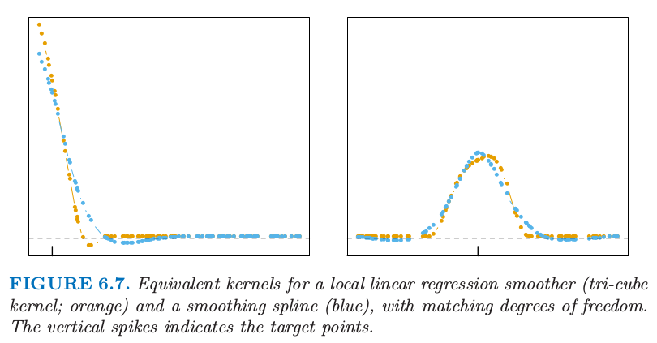

# 6.2 选择核的宽度 

在核 $K_\lambda$ 中，$\lambda$ 为控制核宽度的参数。下面是一些常见核的 $\lambda$ 定义：

- 对于 `Epanechnikov 核` 或`三次立方核`，$\lambda$ 为支撑域的半径。

- 对于高斯核，$\lambda$ 为标准差。

- 对于 $k$-最近邻核，$\lambda$ 为最近邻数量 $k$，经常表达成分数或者整个训练样本的跨距 $k/N$。

很自然地，当改变平均窗口宽度的时候，会存在**偏差和方差之间的权衡**，这对于局部平均是非常明显的：

- 如果窗口较窄，$\hat f(x_0)$ 是离 $x_0$ 近的一小部分 $y_i$ 值的平均，则其方差接近于各 $y_i$ 的方差；而偏差会趋向于较小，因为每一个 $f(x_i)$ 都应当与 $f(x_0)$ 相近。

- 如果窗口较宽，由于平均的效应，$\hat f(x_0)$ 的方差相对于任意 $y_i$ 的方差较小；但偏差会较高，因为现在采用了与 $x_0$ 离得较远的观测 $x_i$，无法保证 $f(x_i)$ 离 $f(x_0)$ 较近。

相似的结论可以应用到局部回归估计，比如局部线性回归：当宽度趋于 $0$ 时，拟合结果近似为 “对训练数据插值得到的分段线性函数” ；当宽度趋于 $\infty$ 时，拟合结果近似为“对数据整体的最小二乘拟合”。
  
>
>$$
\hat f(x_0)= b(x_0)^T(\mathbf {B^TW}(x_0)\mathbf B)^{-1}\mathbf B^T\mathbf W(x_0)\mathbf y\tag{6.8}
>$$
>
>$$
=\sum\limits_{i=1}^Nl_i(x_0)y_i\tag{6.9}
>$$

这里应用[第五章](../05-Basis-Expansions-and-Regularization/5.1-Introduction/index.html)中选择光滑样条的正则化参数时讨论结果。局部回归光滑器是一个线性估计器；$\mathbf{\hat f=S_\lambda y}$ 中的光滑矩阵 $S_\lambda$ 由等价核（ 式 6.8 ）构成，并且其第 $ij$ 个元素值为 $\{\mathbf S_ \lambda\}_ {ij}=l_ {i}(x_ {j})$。留一法交互验证特别地简单（[练习 6.7](https://github.com/szcf-weiya/ESL-CN/issues/150)），广义交互验证 $C_p$（[练习 6.10](https://github.com/szcf-weiya/ESL-CN/issues/151)）以及 $k$ - 折交互验证也比较简单。有效自由度再一次定义为 $\mathrm{trace}(\mathbf S_\lambda)$，并且可以用于校准光滑的程度。

图 6.7 比较了光滑样条和局部线性回归的等价核。局部线性光滑器有 $40\%$ 的跨度 (span)，得到有效自由度 $\mathrm{df}=\mathrm{trace}(\mathbf S_\lambda)=5.86$。光滑样条进行校准后得到同样的 $\mathrm{df}$，并且它们的等价核非常相似。

> 图 6.7.相同自由度下， 局部线性回归光滑器的等价核（三次立方核；橘黄色）以及光滑样条（蓝色）。竖直的钉表示目标点。