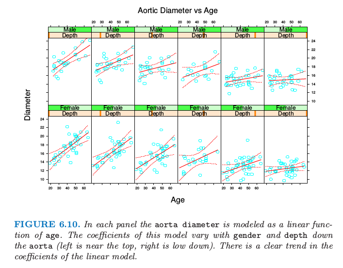
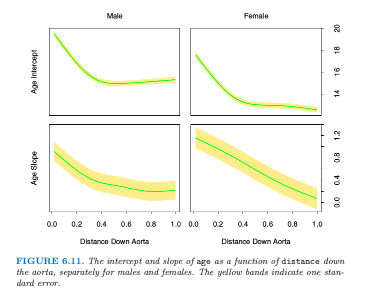

# 6.4 $p$ 维空间中的结构化局部回归

当维度与样本大小的比率不佳时，局部回归对我们没有多大帮助，除非我们愿意对模型进行一些结构性假设。本书的大部分内容是关于结构化回归和分类模型的。这里我们关注一些与核方法直接相关的方法。

##  6.4.1 结构化核

有一种方式是直接修改核。默认的球面核（ 式 6.13 ） 对每个坐标给出了相等的权重，所以一种自然的默认策略是对每个变量标准化得到单位标准差。更一般的方式是使用半正定矩阵 $\mathbf A$ 来对不同坐标赋予权重：

$$
K_{\lambda, A}(x_0,x)=D\left(\frac{(x-x_0)^T\mathbf A(x-x_0))}{\lambda}\right)\tag{6.14}
$$

整个坐标的影响可以通过在 $\mathbf A$ 上加入适当限制来降低或者忽略。举个例子，如果 $\mathbf A$ 为对角矩阵，则可以通过增加或者减小 $A_{jj}$ 来增大或者减小单个预测变量 $X_j$ 的影响。预测变量通常都是高度相关的，比如相似的数字信号或者图像。

预测变量的协方差函数可用于定制不太关注高频对比的度量   $\mathbf A$ （[练习 6.4](https://github.com/szcf-weiya/ESL-CN/issues/196)）。研究者们已经提出了多维核参数训练的方法。举个例子，第 11 章中讨论的投影寻踪回归模型是比较受欢迎的，其中用 $\mathbf A$ 的低秩版本表示了 $\hat f(X)$ 的岭回归。关于 $\mathbf A$ 的更一般的模型很复杂，因此，我们更倾向于接下来讨论的结构化形式的回归函数。

### 6.4.2 结构化的回归函数

我们试着在 $\mathbb{R}^p$ 中拟合回归函数 $\mathbb{E}(Y\mid X)=f(X_1,X_2,\ldots,X_p)$，其中每一个层次都可能存在交互项。很自然地可以考虑下列形式的`方差分析 ( ANOVA )` 分解：

$$
f(X_1,X_2,\ldots,X_p)=\alpha+\sum\limits_jg_j(X_j)+\sum\limits_{k<\ell}g_{k\ell}(X_k,X_\ell)+\cdots\tag{6.15}
$$

接着引入一些消除部分高阶项的结构。可加性模型假设只有主要影响项 $f(X)=\alpha+\sum\limits_{j=1}^pg_j(X_j)$ ；二阶模型会有次数至多为 $2$ 的交互项，以此类推。

在第 9 章中，我们会描述一种用于拟合此类低阶交互模型的`迭代式后向拟合算法`。举个例子，在加性模型中，如果除了第 $k$ 项未知，其他所有项均已知时，可以用 $Y-\sum_{j\neq k}g_j(X_j)$ 在 $X_k$ 上的局部回归来估计 $g_k$；依次对每个函数重复进行，直到收敛为止。重要的细节是，在每一个阶段中，一维局部回归都是必须的。同样的思想可以用来拟合低维的 `ANOVA` 分解。

这些结构模型的一个非常重要但又很特殊的情形是 **可变系数模型** 。举个例子，假设将 $X$ 中的 $p$ 个预测变量分成集合 $(X_1,X_2,\ldots,X_q),q < p$，剩下的变量放进向量 $Z$ 中。接着假设条件线性模型：

$$
f(X)=\alpha(Z)+\beta_1(Z)X_1+\cdots+\beta_q(Z)X_q\tag{6.16}
$$

对于给定的 $Z$，上式为线性模型，但每个参数可以随着 $Z$ 而改变。很自然地可以通过局部加权最小二乘拟合这个模型：

$$
\underset{\alpha(z_0),\beta(z_0)}{\min}\sum\limits_{i=1}^NK_\lambda(z_0,z_i)(y_i-\alpha(z_0)-x_{1i}\beta(z_0)-\cdots - x_{qi}\beta_q(z_0))^2\tag{6.17}
$$

图 6.10 说明了在人类大动脉数据上的一些想法。一个由来已久的说法是 **大动脉** 会随着 `age` 增长而变厚。这里我们将大动脉的 `diameter` 建立为 `age` 的线性函数，但是允许系数随着 `gender` 和 `depth` 的变化而变化。我们对男性和女性分别采用局部回归模型。大动脉确实很明显地（在大动脉比较厚区域中）随着年龄而变厚，这种关系随着到大动脉的距离变远而减弱。图 6.11 显示了截距和斜率作为 `depth` 的函数。

> 图 6.11. 每张图中大动脉的 `diameter` 被建立为 `age` 的线性函数模型。这个模型的系数随着 `gender `和到大动脉 的 `depth`（左边靠近顶端，右边靠近底端）变化。在线性模型中的系数有着明显的趋势。

> 图 6.11. 在男性和女性情形下，`age` 作为 `distance` 变量（到大动脉的距离） 的函数的截距和斜率。黄色带状表示一个标准差。
