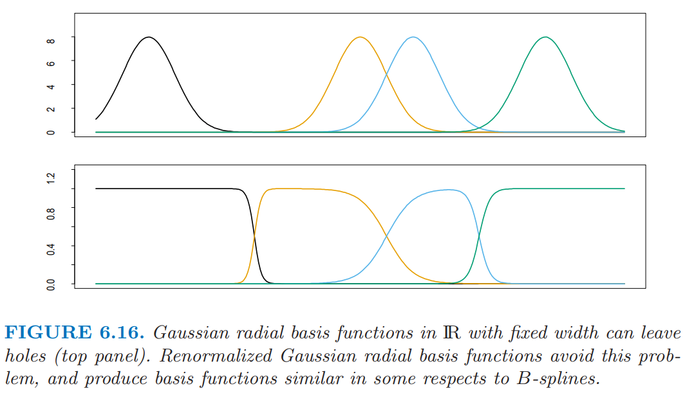

# 6.7 径向基函数和核

在第五章中，函数表示成基函数展开的形式：$f(x)=\sum_{j=1}^M\beta_jh_j(x)$．使用基函数展开进行灵活建模的技术有两部分构成，首先需要选取合适的基函数族，然后通过选择、正则化、或者两者都有的方法来控制表达式的复杂度．有些基函数族的元素是局部定义的，比如，B 样条在 $\IR$ 中局部定义．如果在特定区域中需要更多的灵活性，这个区域则需要用更多的基函数来表示（对于 B 样条，也就是需要更多结点）．$\IR$ 局部基函数的张量积构成了 $\IR^p$ 中的局部基函数．不是所有的基函数都是局部的——举个例子，对于样条的截断幂基，或者在神经网络中使用的 S 型基函数 $\sigma(\alpha_0+\alpha x)$（见 [第 11 章](../11-Neural-Networks/11.1-Introduction/index.html)）．虽然如此，复合函数 $f(x)$ 也可以显示出局部行为，因为参数的特定符号和值造成全局影响的抵消．举个例子，对于同样的函数空间截断幂基有等价的 B 样条基；这种情况下恰恰就是因为抵消．

核方法通过在目标点 $x_0$ 局部的区域中拟合简单的模型来实现灵活性．局部化通过加权核 $K_\lambda$ 来实现，并且单个观测权重为 $K_\lambda(x_0,x_i)$．

**径向基函数 (Radial basis functions)** 将核函数 $K_\lambda(\xi,x)$ 看成基函数．

!!! note "weiya 注：Isotropic covariance vs. Radial basis functions"
    平稳的协方差函数是 $\x - \x'$ 的函数，而如果进一步只跟 $\x$ 和 $\x'$ 间的距离 $\vert \x-\x'\vert$ 有关，则称为 isotropic covariance，也称作 radial basis functions. 

    参考 [WeiYa's Work Yard: Isotropic vs. Anisotropic](https://stats.hohoweiya.xyz/2019/10/24/cov-func/).

这得到模型
$$
\begin{align}
f(x) &= \sum\limits_{j=1}^MK_{\lambda_j}(\xi_j,x)\beta_j\notag\\
&= \sum\limits_{j=1}^MD\left(\frac{\Vert x-\xi_j\Vert}{\lambda_j}\right)\beta_j\tag{6.28}
\end{align}
$$
其中每个基元素由位置或者 **原型 (prototype)** 参数 $\xi_j$ 以及缩放参数 $\lambda_j$ 决定．$D$ 的一个流行的选择是标准高斯密度函数．有许多方式来学习参数 $\\{\lambda_j,\xi_j,\beta_j\\},j=1,\ldots,M$．为了简化，我们关注回归的最小二乘方法，并且采用高斯核．

- 优化关于所有参数的平方和
$$
\underset{\{\lambda_j,\xi_j,\beta_j\}_1^M}{\min}\sum\limits_{i=1}^M\left(y_i-\beta_0-\sum\limits_{j=1}^M\beta_j\exp\left\{-\frac{(x_i-\xi_j)^T(x_i-\xi_j)}{\lambda_j^2}\right\}\right)^2\tag{6.29}
$$

​这个模型一般称为 RBF 网络，这是 S 型神经网络的替代选择，将在 [第 11 章](../11-Neural-Networks/11.1-Introduction/index.html) 讨论；$\xi_j$ 和 $\lambda_j$ 在参数中有重要作用．这个准则是有着多重局部最小点的非凸函数，并且优化的算法类似神经网络中的算法．

- 分开估计 $\\{\lambda_j,\xi_j\\}$ 和 $\beta_j$．给定前者，后者的估计是简单的最小二乘问题．通常单独用 $X$ 的分布，以非监督的方式选择核参数 $\lambda_j$ 和 $\xi_j$．其中一种方式是在给定中心 $\xi_j$ 和缩放 $\lambda_j$ 时，对训练 $x_i$ 拟合高斯混合密度模型．一种特别的方式是使用聚类方法来确定原型 $\xi_j$，并且将 $\lambda_j=\lambda$ 看成是超参数．这些方式的显然缺点是条件分布 $\Pr(Y\mid X)$ 以及 $\E(Y\mid X)$ 是不起作用的．不过它们的优点是，可以更简单地实现．

!!! question "weiya 注：翻译相关"
    原文的 **不起作用 (having no say)** 后面用 "in where the action is concentrated" 进行了修饰，但是不太清楚 "action" 是指什么，以及修饰语想表达什么？

尽管看起来减少参数的个数，并假设 $\lambda_j=\lambda$ 为常数的方法很吸引人，但是这会带来糟糕的副作用——产生 **洞 (holes)**，也就是 $\IR^p$ 存在某个区域，其中没有核有合适的支撑（如图 6.16（上）所示）．对径向基函数重标准化，

$$
h_j(x)=\frac{D(\Vert x-\xi_j\Vert/\lambda)}{\sum_{k=1}^MD(\Vert x-\xi_k\Vert/\lambda)}\,,\tag{6.30}
$$

可以避免这个问题（图 6.16（下））．

$\IR^p$ 中的 Nadaraya-Watson 核回归估计量 \eqref{6.2} 可以看成是重标准化后径向基函数的展开，

!!! note "weiya 注: Recall"
    $$
    \hat f(x_0)=\frac{\sum_{i=1}^NK_{\lambda}(x_0,x_i)y_i}{\sum_{i=1}^NK_{\lambda}(x_0,x_i)}\tag{6.2}\label{6.2}
    $$

$$
\begin{align*}
\hat f(x_0) &= \sum_{i=1}^Ny_i\frac{K_\lambda(x_0,x_i)}{\sum_{i=1}^NK_\lambda(x_0,x_i)}\\
&=\sum_{i=1}^Ny_ih_i(x_0)\tag{6.31}\label{6.31}
\end{align*}
$$

其中基函数 $h_i$ 确定了每个观测的位置以及系数；也就是说，$\xi_i=x_i,\hat\beta_i=y_i,i=1,\ldots,N$.

注意到展开式 \eqref{6.31} 与由 $K$ 导出的正则化问题的解 \eqref{5.50} 间的相似性．径向基函数搭建了现代“核方法”与局部拟合技巧间的桥梁．

!!! note "weiya 注：Recall"
    $$
    f(x)=\sum\limits_{i=1}^N\alpha_i K(x, x_i)\tag{5.50}\label{5.50}
    $$