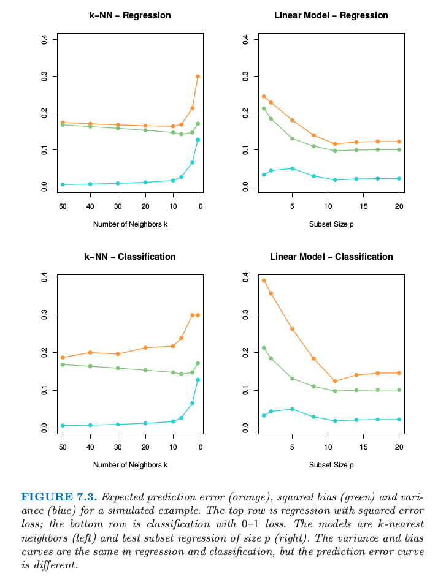

# 7.3 偏差-方差分解
<style>p{text-indent:2em;2}</style>

## （）7.3.1 一般性讨论

<style>p{text-indent:2em;2}</style>

和第 2 章一样，如果假设 $Y=f(X)+\varepsilon$，其中 $\varepsilon$ 是均值为 0 ，方差为 $\sigma_\varepsilon^2$ 的随机噪声，即 $\mathbb{E}(\varepsilon)=0$，并且 $\mathbb{Var}(\epsilon)=\sigma_\varepsilon^2$ 。如果选择平方误差作为损失函数，则可以导出输入点 $X=x_0$ 处的回归估计值 $\hat f(X)$ 的平均预测误差如下：

\begin{align*}
\mathbb{Err}(x_0)&=\mathbb{E}[(Y-\hat f(x_0))^2\mid X=x_0]\\
&=\sigma_\varepsilon^2+[\mathbb{E}\hat f(x_0)-f(x_0)]^2+\mathbb{E}[\hat f(x_0)- \mathbb{E} \hat f(x_0)]^2\\
&=\sigma_\varepsilon^2+\mathbb{Bias}^2(\hat f(x_0))+\mathbb{Var}(\hat f(x_0))\\
&=\mathbb{Irreducible Error} + \mathbb{Bias}^2+\mathbb{Variance}\tag{7.9}
\end{align*}

式中：

- 第一项是系统误差项。该项是目标自身在其真实均值 $f(x_0)$ 处的方差，通常由观测误差引起。理论上无论对 $f(x_0)$ 的估计有多好，该项都不可避免，除非假设 $\sigma_\varepsilon^2=0$。
- 第二项是平方偏差项，是`估计的均值`与`真实的均值`之间的偏差量（可形象理解为估计值与真值之间的距离）；
- 第三项是方差项，是估计值 $\hat f(x_0)$ 在其自身均值处的平方误差平均值（可形象理解为估计值在均值点附近的散布范围或宽度）。

一般而言，建立的模型 $\hat f$ 越复杂，偏差项越低，但是方差项越大。

```{admonition} 公式推导
(7.9) 其实暗含 $\mathbb{E} f(x_0)\mathbb{E}\hat f(x_0)=\mathbb{E}(f(x_0)\hat f(x_0))$，这显然成立，因为我们训练 $\hat f$ 时，完全不知道真实的 $f$，故它们独立。

\begin{align*}
\mathbb{Err}(x_0)&=E[(Y-\hat f(x_0))^2\mid X=x_0]\\
&=E[(f(x_0)+\varepsilon-\hat f(x_0))^2\mid X=x_0]\\
&=\sigma_\varepsilon^2 + E[f(x_0)-E\hat f(x_0)+E\hat f(x_0)-\hat f(x_0)]^2\\
&=\sigma_\varepsilon^2+[E\hat f(x_0)-f(x_0)]^2+E[\hat f(x_0)-E\hat f(x_0)]^2+Ef(x_0)E\hat f(x_0)-E(f(x_0)\hat f(x_0))\\
&=\sigma_\varepsilon^2+[E\hat f(x_0)-f(x_0)]^2+E[\hat f(x_0)-E\hat f(x_0)]^2\\
&=\sigma_\varepsilon^2+Bias^2(\hat f(x_0))+Var(\hat f(x_0))\\
&=\mathbb{Irreducible Error} + \mathbb{Bias}^2+\mathbb{Variance}
\end{align*}

直接根据均方误差分解 (3.20)：

\begin{align*}
\mathbb{Err}(x_0)&=\mathbb{E}[(Y-\hat f(x_0))^2\mid X=x_0]\\
&=\mathbb{E}[(f(x_0)+\varepsilon-\hat f(x_0))^2\mid X=x_0]\\
&=\sigma_\varepsilon^2 + \mathbb{MSE}(\hat f(x_0))\\
&=\sigma_\varepsilon^2+\mathbb{Bias}^2(\hat f(x_0))+\mathbb{Var}(\hat f(x_0))
\end{align*}

或者更具体地：

\begin{align*}
\mathbb{Err}(x_0)&=\mathbb{E}[(Y-\hat f(x_0))^2\mid X=x_0]\\
&=\mathbb{E}[(f(x_0)+\varepsilon-\hat f(x_0))^2\mid X=x_0]\\
&=\sigma_\varepsilon^2 + \mathbb{E}[f(x_0)-\mathbb{E}\hat f(x_0)+\mathbb{E}\hat f(x_0)-\hat f(x_0)]^2\\
&=\sigma_\varepsilon^2+[\mathbb{E}\hat f(x_0)-f(x_0)]^2+\mathbb{E}[\hat f(x_0)-\mathbb{E}\hat f(x_0)]^2+2\mathbb{E}\{[f(x_0)-\mathbb{E} \hat f(x_0)][\mathbb{E}\hat f(x_0)-\hat f(x_0)]\}\\
&=\sigma_\varepsilon^2+[\mathbb{E}\hat f(x_0)-f(x_0)]^2+\mathbb{E}[\hat f(x_0)-\mathbb{E}\hat f(x_0)]^2+2[f(x_0)-\mathbb{E} \hat f(x_0)]\cdot\mathbb{E}[\mathbb{E}\hat f(x_0)-\hat f(x_0)]\\
&=\sigma_\varepsilon^2+[\mathbb{E}\hat f(x_0)-f(x_0)]^2+\mathbb{E}[\hat f(x_0)-\mathbb{E}\hat f(x_0)]^2+2[f(x_0)-\mathbb{E} \hat f(x_0)]\cdot[\mathbb{E}\hat f(x_0)-\mathbb{E}\hat f(x_0)]\\
&=\sigma_\varepsilon^2+[\mathbb{E}\hat f(x_0)-f(x_0)]^2+\mathbb{E}[\hat f(x_0)-\mathbb{E}\hat f(x_0)]^2\\
&=\sigma_\varepsilon^2+\mathbb{Bias}^2(\hat f(x_0))+\mathbb{Var}(\hat f(x_0))\\
&=\mathbb{Irreducible Error} + \mathbb{Bias}^2+\mathbb{Variance}
\end{align*}

```

## （）7.3.2 $k$-近邻方法的误差分解

<style>p{text-indent:2em;2}</style>

对于 $k$-近邻拟合，上述表达式有更简单的形式：

\begin{align*}
\mathbb{Err}(x_0)&=\mathbb{E}[(Y-\hat f_k(x_0))^2\mid X=x_0]\\
&= \sigma_\varepsilon^2+\left[f(x_0)-\frac{1}{k}\sum\limits_{\ell=1}^k f(x_{(\ell)})\right]^2+\frac{\sigma_\varepsilon^2}{k}\tag{7.10}
\end{align*}

这里为了简单我们假设训练输入 $x_i$ 为固定的，则随机性来自 $y_i$。邻居的个数 $k$ 与模型复杂度负相关。对于较小的 $k$，估计出的 $\hat f_k(x)$ 可以对潜在的函数 $f(x)$ 可能有更好的适应性。当 $k$ 增大，偏差一般会增大，但方差会降低。

## （）7.3.3 简单线性回归估计的误差分解

<style>p{text-indent:2em;2}</style>

对于线性回归模型 $\hat f_p(x)=x^T\hat\beta$，其中 $p$ 个输入变量对应的参数向量 $\beta$ 是通过最小二乘拟合的，有：

\begin{align*}
\mathbb{Err}(x_0)&=\mathbb{E}[(Y-\hat f_p(x_0))^2\mid X=x_0]\\
&=\sigma^2_\varepsilon+[f(x_0)-E\hat f_p(x_0)]^2+\Vert\mathbf h(x_0)\Vert^2\sigma_\varepsilon^2\tag{7.11}
\end{align*}

这里 $\mathbf h(x_0)=\mathbf{X}(\mathbf{X}^T\mathbf{X})^{-1}x_0$，是得到拟合 $\hat f_p(x_0)=x_0^T(\mathbf{X}^T\mathbf{X})^{-1}\mathbf{X}^Ty$ 的 $N$ 维线性权重，因此 $\mathbb{Var}[\hat f_p(x_0)]=\Vert \mathbf h(x_0)\Vert^2\sigma_\varepsilon^2$。尽管方差随着 $x_0$ 变化，但它的平均（当 $x_0$ 取遍样本值 $x_i$）为 $(p/N)\sigma^2_\varepsilon$，

```{admonition} 公式推导 
记 $\mathbf{X}=[x_1',x_2',\ldots,x_N']'$，则

\begin{align*}
\sum\limits_{i=1}^N\Vert\mathbf h(x_i)\Vert^2
&=\sum\limits_{i=1}^N\mathbf h^T(x_i)\mathbf h(x_i)\\
&=\sum\limits_{i=1}^Nx_i^T(\mathbf{X}^T\mathbf{X})^{-1}x_i\\
&=\mathbb{trace}[\mathbf{X}(\mathbf{X}^T\mathbf{X})^{-1}\mathbf{X}^T]\\
&=\mathbb{trace}[(\mathbf{X}^T\mathbf{X})^{-1}\mathbf{X}^T\mathbf{X}]\\
&=p
\end{align*}

则方差的平均为 $(p/N)\sigma_\varepsilon^2$。
```

因此有:


$$
\frac{1}{N}\sum\limits_{i=1}^N\mathrm{Err}(x_i)=\sigma_\varepsilon^2+\frac{1}{N}\sum\limits_{i=1}^N[f(x_i)-\mathbb{E}\hat f(x_i)]^2+\frac{p}{N}\sigma_\varepsilon^2\tag{7.12}
$$

这称作 **样本内 (in-sample)** 误差。这里模型复杂度直接与参数个数 $p$ 有关。

## （）7.3.4 岭回归估计的误差分解

<style>p{text-indent:2em;2}</style>

对于岭回归估计 $\hat f_\alpha(x_0)$ 的测试误差 $\mathbb{Err}(x_0)$ 与 式（ 7.11 ） 式相同，除了方差项的线性系数不一样：$\mathbf h(x_0)=\mathbf X(\mathbf {X^TX}+\alpha\mathbf I)^Tx_0$。偏差项也会不一样。

对于线性模型族比如岭回归，我们可以更精细地分解偏差。令 $\beta_*$ 为 $f$ 的最优线性估计的参数：


$$
\beta_*=\mathrm{arg}\;\underset{\beta}{\mathrm{min}}\;E(f(X)-X^T\beta)^2\tag{7.13}
$$

这里期望是对输入变量 $X$ 的分布取的。接着我们可以将 **偏差平方的平均 (average squared bias)** 写成

\begin{align*}
&\mathbb{E}_{x_0}[f(x_0)-E\hat f_\alpha(x_0)]^2\\
&=\mathbb{E}_{x_0}[f(x_0)-x_0^T\beta_*]^2+\mathbb{E}_{x_0}[x_0^T\beta_*-\mathbb{E} x_0^T\hat\beta_\alpha]^2\\
&=\mathbb{Ave[Model Bias]}^2+\mathbb{Ave[Estimation Bias]}^2\tag{7.14}
\end{align*}

右侧的第一项是 **模型偏差 (model bias)** 平方的平均，它是最优线性近似和真实函数之间的误差。第二项是 **估计偏差 (estimation bias)** 平方的平均，它是估计的平均值 $\mathbb{E}(x_0^T\hat\beta)$ 与最优线性近似之间的误差。

对于通过普通最小二乘拟合的线性模型，估计量的偏差为 0。对于约束的拟合，比如岭回归，它是正的，而且我们用减小方差的好处进行交易。模型偏差只可能通过将线性模型类扩大为更广的模型类才能降低，或者通过在模型中加入变量的交叉项以及变换项（通过变量的变换得到的）来降低。

## （）7.4.5 可视化理解偏差与方差之间的权衡

<style>p{text-indent:2em;2}</style>

图 7.2 显示了偏差和方差之间的权衡的原理图。在线性模型的情形下，模型空间是根据 $p$ 个输入变量进行线性预测的集合，标为 “closest fit” 的黑点是 $x^T\beta_*$。蓝色阴影部分区域表示训练样本与真实值（图中的 truth）之间的误差 $\sigma_\varepsilon$。


```{admonition} 图 7.2. 偏差和方差行为的原理图。
模型空间是模型的所有可能的预测的集合，“closest fit”用黑点标出。图中显示了偏离真实值的模型偏差，以及用圆心在标记为“closest fit in population”的黑点处的黄色大圆来表示方差。图中也显示了收缩或者正则化的拟合，它们有额外的估计偏差，但是因为方差的减小导致了更小的预测误差。
```

图中也显示了最小二乘的方差，用圆心在标记为“closest fit in population”的黑点处的黄色大圆来表示。现在如果我们用更少的预测变量来拟合模型，或者通过将它们向 0 收缩来正则化系数，我们会得到图中的 “shrunken fit”。这个拟合有额外的估计偏差，因为它不是模型空间的最近拟合 (closest fit)。另一方面，它有更小的方差。如果方差的减少大于（平方）偏差的增大，则是值得的。

## （）7.4.6 方差-偏差之间的权衡的案例

<style>p{text-indent:2em;2}</style>



```{admonition} 图 7.3 某模拟例子的预测误差的期望（橘黄色），平方偏差（绿色）以及方差（蓝色）。

上面两张图为平方误差损失的回归；下面两张图为 0-1 损失的分类。模型是 $k$ 最近邻（左边）以及大小为$p$的最优子集回归（右）。在回归和分类中的方差和偏差曲线是一样的，但是预测误差曲线是不同的。
```

图 7.3 显示了两个模拟例子的偏差-方差之间的权衡。有 80 个观测，20 个预测变量，在超立方体 $[0,1]^{20}$ 中均匀分布。这些情形如下：

**左图：** 若 $X_1\le 1/2$，$Y=0$，且若 $X_1>1/2$，$Y=1$，而且应用 $k$-最近邻模型。

**右图：** 若 $\sum_{j=1}^{10}X_j>5$，$Y=1$，否则 $Y=0$，且采用大小为 $p$ 的最优子集回归。

上面一行的图是平方误差损失的回归；下面一行的图是 0-1 损失的分类。图中显示了预测误差（红色）、平方误差（绿色）和方差（蓝色），都是用较大的测试样本计算的。

在回归问题中，偏差和方差相加得到预测误差曲线，对于 $k$ 最近邻在 $k=5$ 处有最小值，对于线性模型 $p\ge 10$ 时有最小值。对于分类损失（下图），可以看到一些有趣的现象。偏差和方差曲线与上面的图象相同，而且预测误差指的是误分类比率。我们看到预测误差不再是偏差与方差的和。对于 $k$ 最近邻分类器，当邻居个数增长到 20，预测误差降低或者保持不变，尽管偏差仍在增大。对于线性模型分类器，最小值和回归一样出现在 $p\ge 10$，但是在 $p=1$ 处模型的改进很显著。我们可以看到偏差和方差是相互影响来确定预测误差。

为什么会这样？

第一个现象可以很简单的解释。假设在一个给定的输入点，类别 1 的真实概率为 0.9，而我们估计出的期望值为 0.6。则偏差平方——$(0.6-0.9)^2$——是相当大的，但是预测误差为 0，因为我们作出了正确的判断。换句话说，使我们处于判别边界正确一侧的估计误差没有受到影响。练习 7.2 从分析角度论证这个现象，并且展示了偏差与方差之间的相互影响。

整体情况是偏差与方差之间的权衡在 `0-1 损失` 与 `平方误差损失` 时表现不一样。反过来则意味着：调整参数的最优选择在两种设定下可能有着本质的不同。正如后面章节描述的那样，**我们应该将调整参数的选择建立在对预测误差的估计之上**。
