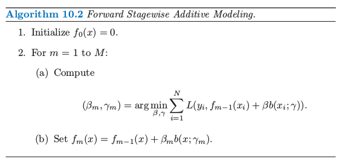

# 10.3 向前逐步加法建模

通过依次向展开式中加入新的基函数且不调整已经加入模型中的参数和系数来向前逐步建立模型，这能够得到 (10.4) 的近似解。

$$
\underset{\{\beta_m,\gamma_m\}_1^M}{\mathrm {min}}\;\sum\limits_{i=1}^NL(y_i,\sum\limits_{m=1}^M\beta_mb(x_i;\gamma_m))\tag{10.4}
$$

在下图算法 10.2 中概述了这一过程。在每次迭代 $m$，求解加入到当前展开 $f_{m-1}(x)$ 的基函数 $b(x;\gamma_m)$ 和对应的系数。这得到 $f_m(x)$，这一过程重复进行。之前加入的项不做修改。

对于平方误差损失

$$
L(y,f(x))=(y-f(x))^2\tag{10.6}
$$

我们有

$$
\begin{align*}
L(y_i,f_{m-1}(x)+\beta b(x_i;\gamma))&=(y_i-f_{m-1}(x)-\beta b(x_i;\gamma))^2\\
&=(\gamma_{im}-\beta b(x_i;\gamma))^2\qquad\tag{10.7}
\end{align*}
$$

其中 $\gamma_{im}=y_i-f_{m-1}(x_i)$ 是当前模型在第 $i$ 个观测值上的残差。因此，对于平方误差损失，每一步中对当前残差最好的拟合项 $\beta_m b(x;\gamma_m)$ 加到展开式中。这个想法是将在 [10.10.2 节](10.10-Numerical-Optimization-via-Gradient-Boosting/index.html) 中讨论的最小二乘回归 boosting 的依据。然而，正如我们将在下一节最后展示的那样，平方误差损失通常不是一个用于分类的良好选择；因此需要考虑其他的损失准则。
