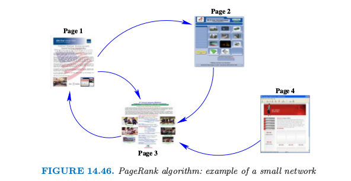

# 14.10 谷歌的PageRank算法

| 原文   | [The Elements of Statistical Learning](https://web.stanford.edu/~hastie/ElemStatLearn/printings/ESLII_print12.pdf) |
| ---- | ---------------------------------------- |
| 翻译   | szcf-weiya                               |
| 发布 | 2016-09-30 |
|更新|2018-01-23|
|状态|Done|

!!! note "写在前面"
	翻译这一节时，已经从多个地方了解到了PageRank算法．最初是在Tan Sir的数学建模课上，后来便是数院短学期有一节讲到PageRank算法，并且布置了相关的课后作业．在那个作业中，是对一个网络利用PageRank进行分析与讨论．翻译完此节，特意去整理了一下那个作业，开了一个仓库来放它，有兴趣的可以看看:grinning:．[传送门](https://github.com/szcf-weiya/miniPR)

这一节我们给出谷歌搜索引擎所采用的最原始的PageRank算法，这是非监督学习的一个有趣的应用．

我们假设有$N$个网页，并且希望对它们进行重要性排序．举个例子，这$N$个页面可能都匹配到字符串“statistical learning”，我们希望对页面按照其可能对浏览者的相关程度进行排序．

PageRank算法考虑如果有很多其他的页面指向一个页面，则该页面是重要的．然而指向一个给定页面的链接网页并不会平等对待：算法考虑链接页面的重要性（PageRank）以及它们向外链接的个数．有高PageRank值的网页被赋予更大的权重，而有更多的向外链接的页面则赋予较小的权重．这个想法得到了PageRank的递归定义，细节如下．

如果页面$j$指向页面$i$，令$L_{ij}=1$，否则为0．令$c_j=\sum_{i=1}^NL_{ij}$等于页面$j$指向的页面个数（向外链接的个数）．则谷歌的PageRank值$p_i$由递归关系定义

$$
p_i=(1-d)+d\sum\limits_{j=1}^N(\frac{L_{ij}}{c_j})p_j\qquad (14.107)
$$

其中$d$为正的常数值（设定为0.85）．

想法是页面$i$的重要性是指向该页面的重要性之和．它们的和赋予权重$1/c_j$，也就是，每个页面分配将总值为1的权重赋予其它页面．常数值$d$保证了每个页面至少得到$1-d$的PageRank值．采用矩阵表示为
$$
\mathbf p = (1-d)\mathbf e+d\cdot \mathbf {LD_c^{-1}p}\qquad (14.108)
$$
其中$\mathbf e$是$N$个元素均为1的列向量，$\mathbf D_c = diag(\mathbf c)$是对角元素为$c_j$的对角矩阵．引入标准化$\mathbf{e^Tp}=N$，则(14.108)可以写成

$$
\begin{array}{ll}
\mathbf p &= [(1-d)\mathbf{ee^T}/N+d\mathbf {LD_c^{-1}}]\mathbf p\\
&= \mathbf{Ap}
\end{array}
\qquad (14.109)
$$

其中矩阵$\mathbf A$是方括号里面的表达式．

利用与Markov链的联系（见下），可以证明矩阵$\mathbf A$有等于1的实值特征值，并且1是其最大的特征值．这意味着我们可以采用幂法来求出$\hat{\mathbf p}$：起始值为$\mathbf p = \mathbf p_0$，进行下面的迭代

$$
\mathbf p_k \leftarrow\mathbf A\mathbf p_{k-1};\qquad \mathbf p_k \leftarrow N\frac{\mathbf p_k}{\mathbf e^T\mathbf p_k}\qquad (14.110)
$$
不动点$\hat{\mathbf p}$则是PageRanks．

在Page et. al(1998)[^1]的原始论文中，作者将PageRank考虑成用户行为的模型，用户随机点击页面，而不去考虑内容．用户在网络上进行随机游走，随机选择有用的向外链接．因子$1-d$是他不去点击链接而直接跳到该页面的概率．

有些PageRank的描述是将$(1-d)/N$作为定义(14.107)式中的第一项，这更符合随机浏览的解释．接着page rank的解(除以$N$)是不可约、非周期Markov链在$N$个网页上的平稳分布．

定义(14.107)也对应一个不可约、非周期Markov链，但转移概率与$(1-d)/N$版本的不同．将PageRank看成Markov链能够更清楚地看出为什么$\mathbf A$有最大的实特征值1．因为$\mathbf A$的元素为正值，且每一列和为1，Markov链的理论告诉我们它有唯一的一个特征值为1的特征向量，对应该Markov链的平稳分布(Bremaud, 1999)[^1]．

图14.46为了说明展示了一个小型的网络．

链接矩阵为

$$
\mathbf L=
\left(
  \begin{array}{llll}
  0 & 0 & 1 & 0\\
  1 & 0 & 0 & 0\\
  1 & 1 & 0 & 1\\
  0 & 0 & 0 & 0
  \end{array}
  \right)
  \qquad (14.111)
$$

向外链接的个数为$\mathbf c = (2,1,1,1)$．

PageRank的解为$\hat{\mathbf p}=(1.49, 0.78, 1.58, 0.15)$．注意到页面4没有进入的链接，因此得到最小的PageRank值0.15．

[^1]: Page, L., Brin, S., Motwani, R. and Winograd, T. (1998). The pagerank citation ranking: bringing order to the web, Technical report, Stanford Digital Library Technologies Project. http://citeseer.ist.psu.edu/page98pagerank.html .
[^2]: Bremaud, P. (1999). Markov Chains: Gibbs Fields, Monte Carlo Simulation, and Queues, Springer, New York.
