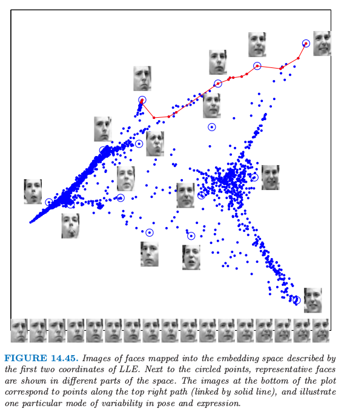

# 14.9 非线性降维和局部多维缩放

最近有人提出了一些用于非线性降维的方法，类似主曲面的思想。想法是将数据看成位于一个嵌在高维空间中的 **固有低维非线性流形 (intrinsically low-dimensional nonlinear manifold)** 的附近。这些方法可以看成是“压扁(flattening)”流形，因此将数据降低至低维坐标系统中，用于表示点在流形中的相对位置。在信噪比非常高的问题中非常有用（比如，物理系统），而且对于有低信噪比的观测数据不是很有用。

基本的目标在图 14.44 的左图中进行了说明。数据落在有较大曲率的抛物线附近。经典的 MDS 不能保持沿着这条曲线的点的顺序，因为它会将处于曲线两端的点看成离得非常近。右图显示了 **局部多维缩放 (local multi-dimensional scaling, Local MDS)** 的结果，我们将在下面讨论非线性多维缩放的三个方法中的其中一个。这些方法仅仅使用 $p$ 维中点的坐标，不需要流形的其它信息。**局部多维缩放** 能够很好地保持沿着曲线的点的顺序。

我们将简短地介绍用作非线性降维和流形映射的三个新方法。

**等距特征映射算法 (Isometric feature mapping, ISOMAP)** (Tenenbaum et al. 2000[^1]) 构造了一个图来近似沿着流形的点之间的测地线距离。具体地，对每个数据点，我们找到其邻居——距该点的某个欧式距离范围内的点。我们构造任意两个邻居点间用边相连的图。任意两点的测地线距离则用图中点的最短路径来近似。最终，对图的距离应用经典缩放，来得到低维映射。

**局部线性内嵌 (Local linear embedding, LLE)**(Roweis and Saul, 2000[^2])采用完全不同的方式，它试图保持高维数据的局部仿射结构。每个数据点用邻居点的线性组合来近似。于是通过寻找保持局部近似的最优方式构造低维表示。细节非常有趣，所以在这里给出：

1. 对每个 $p$ 维中的数据点 $x_i$，寻找欧式距离意义下的 $K$ 最近邻点 $\mathcal N(i)$.
2. 对每个点用邻居点的混合仿射来近似
$$
\underset{w_{ik}}{\min}\Vert x_i-\sum\limits_{k\in\mathcal N(i)}w_{ik}x_k\Vert^2\tag{14.102}
$$
其中权重 $w_{ik}$ 满足 $w_{ik}=0, k\not\in \mathcal N(i), \sum_{k=1}^Nw_{ik}=1$。$w_{ik}$ 是点 $k$ 对 $i$ 点的重构的贡献。注意到为了得到唯一解，我们必须要求 $K < p$。
3. 最后，固定 $w_{ik}$，在 $d < p$ 维空间中寻找点 $y_i$ 来最小化
$$
\sum\limits_{i=1}^N\Vert y_i-\sum\limits_{k=1}^Nw_{ik}y_k\Vert^2\tag{14.103}
$$

在第三步，我们最小化

$$
\tr [(Y-WY)^T(Y-WY)] = \mathrm{tr}[Y^T(\I-W)^T(\I-W)Y)]\tag{14.104}
$$

其中 $W$ 是 $N\times N$; $Y$ 是 $N\times d, d < p$。$\hat Y$ 的解是 $\M=(\I-W)^T(\I-W)$ 的 **尾特征向量 (trailing eigenvectors)**。因为 $1$ 是特征值为 0 的平凡特征向量，所以我们舍弃它并且保留接下来的 $d$ 个。这会产生额外的影响 $1^TY=0$，因此嵌入坐标的均值为0。

!!! note "weiya 注:"
	这里的尾特征向量除去了特征值为 0 的平凡特征向量 $1$，而因为特征向量间正交，所以有 $1^TY=0$. 

**局部多维缩放 (Local MDS)**（Chen and Buja, 2008[^3]）采用最简单的、而且可以说是最直接的方式。定义 $\mathcal N$ 为邻居点的对称集；具体地，如果点 $i$ 在 $i'$ 的 $K$ 最近邻中，则点对 $(i, i')$ 在 $\mathcal N$ 中，反过来也是如此。

!!! note "weiya 注"
	在[14.7节](14.7-Independent-Component-Analysis-and-Exploratory-Projection-Pursuit/index.html)中的谱聚类的 mutual K-nearest-neighbor graph 也有用到 $\mathcal N$。

于是我们构造压力函数

$$
S_L(z_1,z_2,\ldots, z_N) = \sum\limits_{(i,i')\in \mathcal N}(d_{ii'}-\Vert z_i-z_{i'}\Vert)^2 + \sum\limits_{(i,i')\not\in \mathcal N}w\cdot (D-\Vert z_i-z_{i'}\Vert)^2\tag{14.105}
$$

这里 $D$ 是某个较大的常数，$w$ 是权重。想法是将不是邻居的点看成是距离非常远；这些点对被赋予小权重 $w$ 使得它们不会主导整个压力函数。为了简化表达式，取 $w\sim 1/D$，并令 $D\rightarrow \infty$。展开式 式（ 14.105 ），得到

$$
S_L(z_1,z_2,\ldots, z_N)=\sum\limits_{(i, i')\in\mathcal N}(d_{ii'}-\Vert z_i-z_{i'}\Vert)^2-\tau \sum\limits_{(i,i')\not \in \mathcal N}\Vert z_i-z_{i'}\Vert\tag{14.106}
$$

其中 $\tau =2wD$。式 式（ 14.106 ） 试图保持数据的局部性质，而第二项促使非邻居对 $(i, i')$ 的 $z_i,z_{i'}$ 更远。局部多维缩放在固定邻居个数 $K$ 以及调整参数 $\tau$ 的情况下，在 $z_i$ 上最小化压力函数 式（ 14.106 ）。

图 14.44 的右图显示了采用 $k=2$ 个邻居和 $\tau = 0.01$ 的局部多维缩放的结果。我们采用多个起始值的 **坐标下降 (coordinate descent)** 来寻找（非凸）损失函数一个好的最小值。沿着曲线的点的顺序大部分都被保持了。

图 14.45 显示了 LLE 方法的一个有趣的应用。数据包含 1965 张图象，数字化为 $20\times 28$ 的灰白图象。图中展示了 LLE 的前两个坐标结果，它们解释了摆放位置以及表情的一些变异。类似的图象可以通过局部多维缩放得到。

!!! note "原书脚注: "
	Sam Roweis 和 Lawrence Saul 友好地提供了图 14.45.

在 Chen and Buja(2008)[^3] 报告的实验中，局部多维缩放与 ISOMAP 和 LLE 相比表现得更好。他们也演示了局部多维缩放在图象布局方面很有用的应用。有些方法与这里讨论的方法有着紧密的联系，如谱聚类（[14.5.3 节](14.5-Principal-Components-Curves-and-Surfaces/index.html)）和核主成分（[14.5.4 节](14.5-Principal-Components-Curves-and-Surfaces/index.html)）。

[^1]: Tenenbaum, J. B., de Silva, V. and Langford, J. C. (2000). A global geometric framework for nonlinear dimensionality reduction, Science 290: 2319–2323.
[^2]: Roweis, S. T. and Saul, L. K. (2000). Locally linear embedding, Science 290: 2323–2326.
[^3]: Chen, L. and Buja, A. (2008). Local multidimensional scaling for nonlinear dimension reduction, graph drawing and proximity analysis, Journal of the American Statistical Association.
