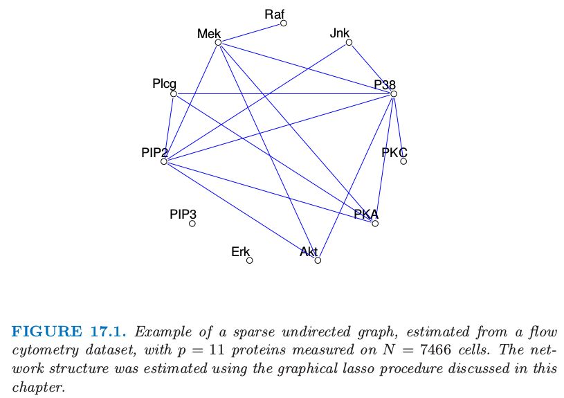

# 17.1 导言

**图 (Graph)** 由顶点（结点）集，以及连接顶点对的边集构成。在图模型中，每个顶点表示一个随机变量，并且图给出了一种理解全体随机变量联合分布的可视化方式。对于监督学习和非监督学习它们都是很有用的。在 **无向图 (undirected graph)** 中，边是没有方向的。我们仅限于讨论无向图模型，也称作 **马尔科夫随机域 (Markov random fields)** 或者 **马尔科夫网络 (Markov networks)**。在这些图中，两个顶点间缺失一条边有着特殊的含义：对应的随机变量在给定其它变量下是条件独立的。

图 17.1 显示了一个图模型的例子，这是 $p=11$ 个蛋白质在 $N=7466$ 个细胞中的 `flow-cytometry` 数据集，取自 Sachs et. al (2005)[^1]。图中的每一个顶点对应蛋白质表达水平的真实值。网络结构是在假定多元高斯分布情况下利用本章后面将要讨论的 graphical lasso 过程估计得到的。

> 图 17.1. 稀疏无向图的例子，从 `flow-cytometry` 数据集中估计得到，含有 $p=11$ 个蛋白质在 $N=7466$ 个细胞中的测量值。网络结构是通过本章后面将要讨论的 graphical lasso 过程进行估计的。

稀疏图有相对少的边数，而且非常方便来解读。在各种领域中都有用，包括基因和蛋白质，这些领域中图模型给出了细胞通路的大致模型。在定义和理解图模型上已经有很多工作，参见 [文献笔记](Bibliographic-Notes/index.html)。

正如我们将要看到的，图中的边用值 (value) 或者 **势 (potential)** 参量化，来表示在对应顶点上的随机变量间条件依赖性的强度大小。采用图模型的主要挑战是模型选择（选择图的结构）、根据数据来估计边的参数，并且从联合分布中计算边缘顶点的概率和期望。后两个任务在计算机科学中有时被称作 **学习 (learning)** 和 **推断(inference)**。

我们不去试图全面地了解这个有趣的领域。相反地，这里仅仅介绍一些基本的概念，并且讨论一些估计参数和无向图结构的简单方法；涉及这些技巧的方法已经在本书中讨论了。我们介绍的的估计方式对于连续值和离散值的顶点的情形是不同的，所以我们分别对待它们。[17.3.1 节](17.3-Undirected-Graphical-Models-for-Continuous-Variables/index.html#_1) 和 [17.3.2 节](17.3-Undirected-Graphical-Models-for-Continuous-Variables/index.html#_2)可能是特别有意义的，因为描述了一个全新的、基于回归的过程来估计图模型。

关于 **有向图 (directed graphical models)** 或者 **贝叶斯网络 (Bayesian networks)** 有大量并且活跃的文献；这是边有方向箭头（但是没有有向环）的图模型。有向图模型表示可以分解成条件分布乘积的概率分布，并且有解释因果关系的潜力。建议读 Wasserman (2004)[^2] 对无向图和有向图的有个大概的了解；下一节与 [18 章](../18-High-Dimensional-Problems/18.1-When-p-is-Much-Bigger-than-N/index.html) 联系很紧密。更多有用的参考文献在文献笔记中给出。

[^1]: Sachs, K., Perez, O., Pe’er, D., Lauffenburger, D. and Nolan, G. (2005). Causal protein-signaling networks derived from multiparameter singlecell data, Science 308: 523–529.
[^2]: Wasserman, L. (2004). All of Statistics: a Concise Course in Statistical Inference, Springer, New York.