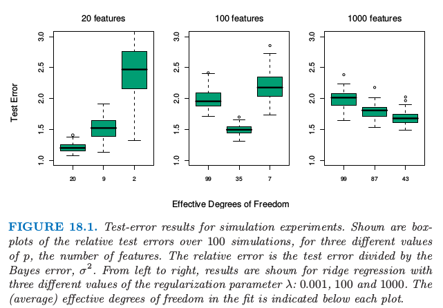

# 18.1 当p远大于N

| 原文   | [The Elements of Statistical Learning](https://web.stanford.edu/~hastie/ElemStatLearn/printings/ESLII_print12.pdf) |
| ---- | ---------------------------------------- |
| 翻译   | szcf-weiya                               |
| 发布 | 2017-03-14 |
| 更新   | 2019-08-17 10:52:02                  |
| 状态 | Done |

!!! note "更新笔记"
    @2017-12-28 使用 R Notwbook 记录了模拟本节中的例子的具体过程，详见[**这里**](../notes/HighDim/sim18_1/index.html)．

这章中我们讨论特征的个数 $p$ 远大于观测的个数 $N$ 的预测问题，通常写成 $p >> N$．这样的问题变得越来越重要，特别是在基因和其他计算生物的领域中．我们将会看到这种情形下，**高方差 (high variance)** 和 **过拟合 (overfitting)** 是主要的考虑对象．结果表明，经常选择简单、高正则化的方式．本章的第一部分关注分类和回归中的预测问题，而第二部分讨论特征选择和特征评估这些更基本的问题．

首先，图 18.1 总结了一个小型的仿真结果，展示了 $p >> N$ 时，“**欠拟合更好 (less fitting is better)**”的原则．对 $N=100$ 个样本中的每一个，我们生成 $p$ 个成对相关系数为 $0.2$ 的标准高斯特征 $X$．响应变量 $Y$ 根据下面线性模型产生，

$$
Y=\sum\limits_{j=1}^pX_j\beta_j+\sigma\varepsilon\tag{18.1}
$$

其中 $\varepsilon$ 产生于标准高斯分布．对于每个数据集，系数 $\beta_j$ 也从标准高斯分布中产生．我们研究三种情形：$p=20,100,1000$．在每种情形下标准误差的选取 $\sigma$ 都使得信噪比 $\Var[\E(Y\mid X)]/\sigma^2$ 等于$2$．结果表明，单变量回归系数显著的个数分别为 9，33 和 331，这是在 100 次模拟中平均得到的．$p=1000$ 的情形是用来模拟高维数据，这些数据可能是基因数据或者蛋白质数据．

!!! note "weiya 注："
    注意 $z_{0.975} = 1.96 \approx 2$，则如果 $\vert\hat\beta_j/\widehat{se}_j\vert\ge 2$，则称回归系数显著，其中 $\hat\beta_j$ 为估计的（单变量）系数，$\widehat{se}_j$ 是它的标准误差估计．

> 图 18.1. 模拟实验的测试误差结果．显示了 3 个不同 $p$ 值（特征的数目）下，100 次模拟的相对测试误差的箱线图．相对误差是测试误差除以贝叶斯误差 $\sigma^2$．从左到右，显示了三个不同的正则化参数 $\lambda:0.001,100,1000$ 的岭回归的结果．拟合中的（平均）有效自由度在每张图的下面标出来了．

我们对数据进行岭回归拟合，其中采用了三个不同的正则参数 $\lambda:0.001,100,1000$．当 $\lambda=0.001$，这近似与最小二乘一样，仅仅有一点正则来保证当 $p > N$ 时，问题不是奇异的．图 18.1 显示了在每个情形下不同的估计达到的相对测试误差的箱线图．在每个岭回归拟合中使用的对应的平均自由度（\eqref{3.50}）也标出来了．

!!! note "Recall: \eqref{3.50}"
    $$
    \begin{align}
    \df(\lambda)&=\tr[\mathbf{X}(\mathbf{X^TX}+\lambda\mathbf{I})^{-1}\mathbf{X}^T]\notag\\
    &=\tr(\mathbf{H}_{\lambda})\notag\\
    &=\sum\limits_{j=1}^p\dfrac{d_j^2}{d_j^2+\lambda}\tag{3.50}\label{3.50}
    \end{align}
    $$

自由度是一个比 $\lambda$ 更有解释性的参数．从图中我们看到，在 $p=20$ 时，$\lambda=0.001$(20df) 的岭回归最优；当 $p=100$ 时 $\lambda=100$(35df) 最优，并且当 $p=1000$时 $\lambda=1000$(43df) 最优．

这些结果可以解释如下．当 $p=20$ 时，我们拟合所有的情形，并且可以以低偏差尽可能地识别更多的显著系数．当 $p=100$ 时，我们可以采用中等程度的收缩识别一些非零的系数．最后，当 $p=1000$ 时，即使有许多非零系数，我们并不希望找到它们，并且我们需要收缩它们．为了说明这个结论，令 $t_j=\hat\beta_j/\widehat{se}_j$，其中 $\hat\beta_j$ 是岭回归估计，而 $\widehat{se}_j$ 是标准误差的估计．接着在这三种情形中取最优的岭回归参数，$\vert t_j\vert$ 为 2.0,0.6 和 0.2，并且超过 2 的 $\vert t_j\vert$ 的平均个数等于 9.8,1.2 和 0.0．

$\lambda=0.001$ 的岭回归成功利用了当 $ p < N$ 时的特征的相关性，但是当 $ p > > N$ 时不能这样处理．在后者的情形下，在相对较少的样本中没有足够的信息来有效估计高维协方差阵．这种情形下，更大的正则化会有更好的预测表现．

因此高维数据的分析要求对 $N > p$ 情形的方法进行改动，或者采用全新的方法．这章中我们讨论用于高维分类和回归问题时的两种方式的例子；这些方法趋向有更重的正则化，使用 **科学的语境知识 (scientific contextual knowledge)** 来得到适当形式的正则化．这章以 **特征选择 (feature selection)** 和 **多重检验 (multiple testing)** 结束．
